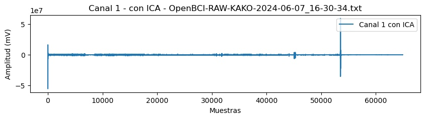
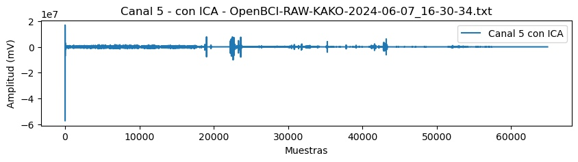

# Laboratorio 10 - Procesamiento de la señal EEG

## Introducción 
El procesamiento de señales EEG (Electroencefalografía) desempeña un papel fundamental en la comprensión de la actividad eléctrica del cerebro humano. En este proyecto, se exploran diversas técnicas y metodologías para el análisis avanzado de señales EEG con el objetivo de extraer información relevante y significativa. Este proceso abarca desde la ingeniería de características y la extracción de características hasta el filtrado y el preprocesamiento de señales, con el fin de mejorar la calidad y la interpretación de los datos obtenidos.

El pipeline de procesamiento diseñado integra técnicas como el Análisis de Componentes Independientes (ICA) y la transformada Wavelet, ofreciendo opciones tanto para el análisis continuo como discreto de la señal. Estas herramientas permiten investigar patrones complejos y detectar eventos específicos dentro de las mediciones EEG, facilitando así la identificación de correlaciones relevantes con estados cognitivos o condiciones neurológicas.

A través de la revisión y el análisis crítico de literatura, se contextualizan y validan los enfoques seleccionados, enriqueciendo el marco teórico del proyecto con investigaciones previas y descubrimientos relevantes. Este enfoque no solo busca avanzar en la comprensión teórica de la EEG, sino también en la aplicación práctica de sus hallazgos para mejorar diagnósticos clínicos, terapias personalizadas y el desarrollo de interfaces cerebro-computadora.

## Objetivos
- Investigar técnicas avanzadas de procesamiento de señales EEG.
- Implementar métodos eficaces de filtrado y extracción de características.
- Evaluar el uso de técnicas como el Análisis de Componentes Independientes (ICA) y transformadas Wavelet.
- Contribuir al avance del conocimiento en EEG aplicada mediante la integración de métodos teóricos y prácticos.

## Metodología

### Filtrado (ICA)
Para realizar el filtrado de la señal, se diseñó y se aplicó un filtro pasa banda Butterworth a los datos con frecuencias de corte de 0.3 Hz y 30 Hz. Se configuró la estructura de datos utilizando la biblioteca MNE, definiendo nombres de canales y una frecuencia de muestreo (fs) de 125 Hz. Se aplicó el Análisis de Componentes Independientes (ICA) para eliminar artefactos como ruido ocular o muscular.

### Preprocesamiento (Normalización)
Se realizó normalización Z-score para facilitar la comparación y el análisis de las señales EEG.

### Extracción de características (Wavelet continua o discreta)
Se exploró la extracción de características utilizando transformadas Wavelet continua y discreta para analizar diferentes escalas de frecuencia en las señales EEG.

## Resultados 
Se presentan los resultados obtenidos del proceso de filtrado y preprocesamiento.

    

- **Filtrado pasabanda e ICA**
  - Se aplicó correctamente el filtro pasa banda Butterworth configurado e ICA.

- **Preprocesamiento (Normalizado)**
  - Se normalizaron los datos utilizando Z-score para facilitar la comparación y análisis.

- **Extracción de Características (Wavelet continua o discreta)**
  - Se exploraron técnicas de extracción de características mediante transformadas Wavelet.

    

    

    

    

    

    

    

    

    

    

    

    

    

    

    

## Discusión

Luego de aplicar ICA a las señales EEG se obtuvo una reducción significativa de artefactos en todos los canales. 
	
### Filtrado 
Las oscilaciones en el EEG en estado de reposo representan diversas actividades intrínsecas entre ellas el ritmo sensoriomotor (SMR) con forma de arco en bandas alfa y beta que depende de la relación SNR lograda por filtros espaciales. Filtros espaciales CAR y laplaciano tuvieron mejores resultados al mejorar la relación SNR. [3]

El ritmo ritmo sensoriomotor (SMR) es la actividad registrada sobre la corteza motora se caracteriza por un ritmo mu y un ritmo beta en forma de arco que oscila entre una frecuencia de banda alfa ( 7 - 11 Hz) y banda beta (12 - 30 Hz)  [6]

Las oscilaciones intrínsecas en estado de reposo se ha propuesto como biomarcadores predictivos y de seguimiento del aprendizaje motor o recuperación de enfermedades fisiológicas [4] 

### ICA Eliminación de artefactos 
La técnica de Análisis por componentes Independientes (ICA) se utiliza para mejorar SNR eliminando los artefactos presentados en la adquisición. Existen diversos algoritmos ICA como FastICA, Infomax y SOBI cuya diferencia radica en el criterio para cuantificar la independencia de las fuentes estimadas. El algoritmo Infomax permite una mejor identificación de los componentes ICA, resultando en potencial de disparidad (Mismatch Negativity, MMN) de mayor amplitud y distribución topográfica fronto-central con predominancia izquierda. [8]

La identificación de artefactos se realiza mediante un análisis sistemático que considera su ubicación en el mapa topográfico, su actividad por épocas con respecto al tiempo y su espectro de potencia.

Los artefactos oculares, son identificados por una marcada proyección frontal en el mapa topográfico, la presencia de un pico de baja frecuencia de 1 a 3 Hz para el parpadeo o un decremento de la potencia a lo largo del espectro. El ruido muscular se caracteriza por estar espacialmente localizado en el mapa topográfico dependiendo del músculo que lo genere, una actividad mayor con respecto al tiempo en ciertas épocas y picos entre 10 - 20 Hz en el espectro de potencia. Los artefactos por alta impedancia presentan mapas topográficos con alta concentración de energía de un electrodo específico y un pequeño pico alrededor de 20 Hz en el espectro de potencia. Finalmente, los artefactos cardíacos, están caracterizados por un mapa topográfico con alta concentración de energía, aumentos periódicos de actividad en algunas épocas y dos picos entre 5 - 10 Hz en el espectro de potencia. [8-9]

Los artefactos identificados se muestran en la figura 1 según su actividad de las épocas respecto al tiempo y espectro de potencia son: componentes corticales (a-c), artefactos oculares (d-e), artefacto muscular (F) , electrodo de alta impedancia (f), artefacto de origen desconocido (h) [8]

    

Figura 1. Identificación de artefactos mediante tres algoritmos de procesamiento. (FastICA, Infomax, SOBI) [8]

### Preprocesamiento Normalizado
Facilitar la comparación y análisis 
Z-score 
Normalización por desviación estándatar 

### Potencia del campo global  (GFP) 

La actividad eléctrica se puede describir mediante GFP que representa la fuerza del campo eléctrico sobre el cerebro en cada instante. Se utiliza para medir la respuesta cerebral global a un evento o para caracterizar los cambios rápidos de la actividad cerebral. 

    

Los instantes de mayor intensidad de campo y  mayor relación topográfica señal - ruido (SNR)  están representados por los máximos locales de la curva GFP, los cuales se consideran estados discretos del EEG en el análisis de microestados siendo la evolución de la señal una serie de estos estados (A-D) lo que genera mapas topográficos de la matriz de electrodos. La señal EEG multicanal es descrita como una serie de microestados alternos con una duración de 80 - 120 ms cada uno de estos periodos de cuasi estabilidad de mapas individuales. [1]

    

Figura 1. Ilustración del método de agrupamiento y análisis de microestados. Curva GFP en rojo 

Los microestados surgen de la actividad coordinada de conjuntos neuronales que abarcan grandes áreas de la corteza, dando lugar a un patrón global de coherencia coordinada que genera los mapas de microestados casi estables. 

Las transiciones entre microestados representan la activación secuencial de diferentes redes neuronales , y la serie temporal de microestados nos indica el cambio entre las actividades de los conjuntos neuronales del cerebro en reposo. Por lo tanto, el GFP de un determinado microestado puede reflejar la fuerza o el grado de coordinación de las neuronas en los generadores neuronales subyacentes

### Feature Extraction

La principal característica extraía de las señales EEG son la Densidad de poder espectral ( Power Spectral Density). Un estudio evaluó el cerebro de atletas de natación, realizaron un experimento que constó de un estado de vigilia con los ojos cerrados (EC) por 2 minutos, seguido por 2 minutos de ojos abiertos (EO) fijos en una pantalla. Luego, realizaron la acción compleja (CR) que involucra ojo-mano-pie considerada una característica de comportamiento que distingue a los nadadores de élite. La principal diferencia entre grupos, fue una mejor coordinación ojo-mano-pie con un tiempo de reacción más rápido que los controles, respaldado por las conexiones escasamente cableadas en la banda beta superior (20-30 Hz) pero energéticamente eficientes que se reflejan en un rendimiento motor y cognitivo superior. Además de presentar tasas de parpadeo más estables y bajas. [7]

    

Figura 2. Cambios del espectro de potencia desde la condición EO al estado de tarea CR. Topología y características de frecuencia media en 2 grupos . ES: nadadores de élite. CG: grupo control 

### Conclusión 
La eliminación de diferentes artefactos tanto fisiológicos como no fisiológicos es posible mediante ICA, lo cual permite la obtención de una señal limpia para la extracción de características relevantes como el espectro de potencia. 

## Referencias bibliográficas
[1] A. Khanna, A. Pascual-Leone, C. M. Michel, and F. Farzan, “Microstates in resting-state EEG: Current status and future directions,” vol. 49. Elsevier BV, p. 105, 17-Dec-2014.

[2] M. Dinov and R. Leech, “Modeling Uncertainties in EEG Microstates: Analysis of Real and Imagined Motor Movements Using Probabilistic Clustering-Driven Training of Probabilistic Neural Networks,” vol. 11. Frontiers Media SA, 01-Nov-2017.

[3] S. Tsuchimoto et al., “Use of common average reference and large-Laplacian spatial-filters enhances EEG signal-to-noise ratios in intrinsic sensorimotor activity,” vol. 353. Elsevier BV, 27-Jan-2021.

[4] S. Vahdat, M. Darainy, T. E. Milner, and D. J. Ostry, “Functionally Specific Changes in Resting-State Sensorimotor Networks after Motor Learning,” vol. 31, no. 47, pp. 16907–16915, 2011.

[5] S. Coelli et al., “Selecting methods for a modular EEG pre-processing pipeline: An objective comparison,” vol. 90. Elsevier BV, 14-Dec-2023.

[6.] J. W. Kozelka and T. A. Pedley, “Beta and Mu Rhythms,” vol. 7, no. 2, p. 191, Apr. 1990.

[7] X. Pei et al., “Sparsely Wiring Connectivity in the Upper Beta Band Characterizes the Brains of Top Swimming Athletes,” vol. 12, p. 661632, Jul. 2021, doi: 10.3389/fpsyg.2021.661632. [Online]. Available: https://www.ncbi.nlm.nih.gov/pmc/articles/PMC8322235/. [Accessed: 20-Jun-2024]

[8] L. A. Porras-Illescas, A. Jiménez-González, N. Castañeda-Villa, L. A. Porras-Illescas, A. Jiménez-González, and N. Castañeda-Villa, “Uso del Análisis por Componentes Independientes en la extracción de artefactos de la respuesta Mismatch Negativity,” vol. 38, no. 2, pp. 420–436, 2017, doi: 10.17488/rmib.38.2.1. [Online]. Available: http://www.scielo.org.mx/scielo.php?script=sci_abstract&pid=S0188-95322017000200420&lng=es&nrm=iso&tlng=es. [Accessed: 20-Jun-2024]

[9]  T. P. Jung, S. Makeig, C. Humphries, T. W. Lee, M. J. McKeown, V. Iragui, et al. “Removing electroencephalographic artifacts by blind source separation,” Psychophysiology, 37, pp. 163-178, 2000. DOI: 10.1111/1469-8986.3720163 [ Links ]

### Extra
Si tiene problemas con el pdf puede seguir el camino de  Documentacion/Laboratorios/Lab10_EEG

- [PDF1]("../../../../../../Documentacion/Laboratorios/Lab10_EEG/A%20review%20of%20EEG%20Signal%20Analysis%20for%20Diagnosis%20of%20Neurological%20Disorders%20using%20Machine%20Learning.pdf")

- [PDF2]("../../../../../../Documentacion/Laboratorios/Lab10_EEG/EBSCO-FullText-2024-06-14.pdf")
