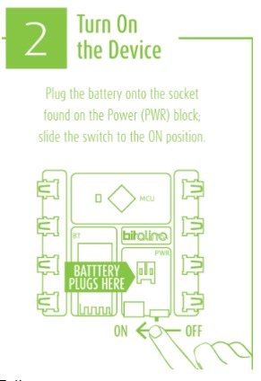
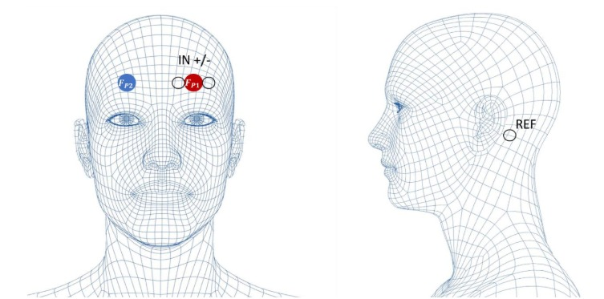
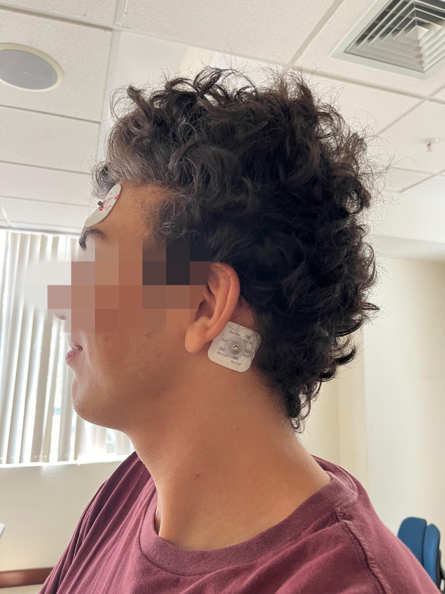

# LABORATORIO 5 - MEDICIÓN DE SEÑAL EEG

## TABLA DE CONTENIDOS

- [Introducción del laboratorio](#introducción-del-laboratorio)
- [Objetivos](#objetivos)
- [Materiales y equipos](#materiales-y-equipos)
- [Procedimiento](#procedimiento)
- [Desarrollo experimental](#desarrollo-experimental)
- [Discusión y conclusiones](#discusión-y-conclusiones)
- [Referencias](#referencias)

## Introducción del laboratorio

En 1875, se registraron los primeros experimentos en neurofisiología realizados en animales por Richard Caton, quien sentó las bases en este campo. Posteriormente, en 1924, Hans Berger, psiquiatra alemán, reconoció la importancia de los avances de Caton en sus estudios sobre las ondas Alfa del cerebro [1]. El electroencefalograma (EEG) es un instrumento para medir los potenciales que se generan por la actividad cerebral. Se utiliza para estudiar la actividad del cerebro, principalmente para evaluar a pacientes para detectar convulsiones y epilepsia. A pesar de que las técnicas de imágenes avanzadas se utilizan para el diagnóstico, el EEG sigue siendo una herramienta efectiva para la detección de convulsiones [2].

El EEG también se ha incorporado en algunas clínicas para apoyarse del equipo en diferentes aplicaciones. Por ejemplo, en procedimientos quirúrgicos, el EEG puede medir el estado de sueño del paciente, para asegurar la correcta administración del la anestesia. También, se observó su utilidad para el monitoreo de isquemia o infarto, debido a su sensibilidad para detectar cambios potenciales. Además, se utiliza para la investigación de patologías mediante el análisis del funcionamiento visual, auditivo y cognitivo [2].

Para la obtención de las señales de EEG, se utilizan electrodos que se colocan en el cuero cabelludo. Los electrodos detectan potenciales generados por las neuronas corticales y ayudan a entender la interacción entre la corteza cerebral y las estructuras subcorticales. Además de caracterizar las frecuencias de onda específicas, como alfa, beta, theta y delta, también revela componentes, como los husos del sueño y los complejos K, que se utilizan para diferenciar las etapas del sueño y proporcionar información crucial sobre la actividad cerebral [1].

## Objetivos
- Adquirir señales biomédicas de EEG
- Hacer una correcta configuración de BiTalino y del Ultracortex Mark IV
- Extraer la información de las señales EEG del software OpenSignals (r)evolution y OpenBCI

## Materiales y equipos

| Cantidad | Equipo/Material          |
|----------|--------------------------|
| 1        | Kit BiTalino (R)EVOLUTION|
| 1        | Ultracortex Mark IV      |
| 1        | Laptop o PC              |
| 3        | Electrodos               |

## Procedimiento

1. **Instalación de OpenSignals**
- Instalar [OpenSignals (r)evolution](https://www.pluxbiosignals.com/collections/bitalino/products/bitalino-revolution-boardkit-ble-bt) <br>
   Downloads -> OpenSignals -> Download 64
   

2. **Conexión del BITalino con OpenSignals**
- Activar el Bluetooth para configurar la tarjeta BITalino
- Conectar la batería a la placa BITalino
- Encender la placa 

<div align="center">
   
    <p>Figura 1. Manual de BiTalino [3]
</div>

- Buscar la tarjeta BITalino 
<div align="center">
   
    <p>Figura 2. Pantalla de Inicio OpenSignals
</div>

- Agregar el pin “1234” que se muestra en la guía de inicio rápido
- Listo aparecerá de color azul la opción Enable en OpenSignals lo que indica que el BITalino está listo para usarse. 
- Conectamos los cables a A2 que es el puerto para Electroencefalograma (EEG)  [User Manual]
- Colocar los electrodos en los cables y ponerlos en el lugar de la medición. 
<div align="center">
   
    <p>Figura 3. Canales del BiTalino. Usamos A4 [3]
</div>

3. **Posicionamiento de los electrodos**

Se utilizó como guía para la colocación de electrodos al BITalino “BITalino HOME-GUIDE #3 ELECTROENCEPHALOGRAPHY (EEG) Exploring Brain Signals”. Según su protocolo, se colocaron los electrodos en las muñecas y cresta ilíaca como se muestra en la figura 4. 
<div align="center">
   
    <p>Figura 4. Posicionamiento de electrodos para medir EEG en la posición FP1: Pines de medición IN+/- (en la frente) y referencia (atrás de la oreja). [3]
</div>

4. **Protocolo del laboratorio**
   - Registrar una línea base de señal con poco ruido durante 30 segundos.
   - Realizar un ciclo de ojos abiertos y cerrados, manteniendo ambas fases durante cinco segundos.
   - Realizar una fase de referencia adicional, 30 segundos.
   - Realizar ejercicios mentales mientras se registran las señales, enfocando la mirada en un punto fijo.
   - Guardar los datos

> En nuestro grupo, no se tuvo el tiempo suficiente para llegar a hacer la práctica con el Ultracortex, sin embargo nos colaboraron con sus datos el grupo 9. Desde aquí, les sugerimos visiten también su página para una mayor información directa. Describiremos esas partes con el txt brindado
5. **Instalación de OpenBCI GUI**
- Instalar [OpenBCI GUI:](https://openbci.com/downloads ) <br>
   Downloads -> OPENBCI GUI v5.2.2 -> Download 64
6. **Conexión del OpenBCI GUI con Ultracortex Mark IV**
- Conectar el ultracortex con el software del OpenBCI para poder empezar a sensar los datos
- Seguir el mismo protocolo del laboratorio para cada medición de señal del EEG


## Desarrollo experimental

### Fotos de conexión usada (Electrodos-cuerpo/cabeza)

Se presenta las conexión de los electrodos en la cabeza

<div align="center">
   
   
    <p>Figura 5. Foto de la conexión del Electrodos en la cabeza positiva y negativa, con la referencia para el BiTalino
</div>

### Video de señal con Bitalino
- **Línea de Base (en relajación y respirando):** El sujeto de prueba mantuvo una respiración normal y tranquila, con baja interferencias y sin movimientos.
<div style="text-align: center;">
  <a href="https://youtube.com/shorts/wIw47Hbf4Bk?feature=share">
    
  </a>
</div>

- **Ciclo de Ojos Abiertos - Ojos Cerrados:** El sujeto de prueba empezó con los ojos abiertos durante 5 segundos y luego los cerro durante otros 5 segundos en un ciclo.
<div style="text-align: center;">
  <a href="https://youtube.com/shorts/ER90EbJKS50?feature=share">
    
  </a>
</div>

- **Segunda Línea de Base:** El sujeto de prueba mantuvo una respiración normal y tranquila, con baja interferencias y sin movimientos por segunda vez.
<div style="text-align: center;">
  <a href="https://www.youtube.com/shorts/1iEKcywvsMk">
    
  </a>
</div>

- **Resolviendo mentalmente ejercicios:** El sujeto de prueba tuvo 12 segundos para pensar en distintos problemas matemáticos 3 Sencillos y 3 Complicados [4]
<div style="text-align: center;">
  <a href="https://www.youtube.com/watch?v=FIfHXdRAVl4">
    
  </a>
</div>

### Ploteo de la señal en Python
En la parte de abajo se encuentran los códigos usados para adquirir estas señales por python, de la misma forma se entrega un único ejemplo de este. <br>
Código de ejemplo:
```python
#PLOTEO SEÑAL EEG - Reposo 30s ojos cerrados 

#Importamos librerias 
import numpy as np
import matplotlib.pyplot as plt
import pandas as pd
import seaborn as sns
import re

#Abrimos el archivo txt
f = open("ojos_cerrados_30seg.txt","r")
raw_data = f.readline()  # con f.read() leemos todo el contenido
f.close()
raw_data

Fs = 1000
Ts = 1/Fs
print(f" Fs = {Fs} hz\n Ts = {Ts} s")

#Leer el archivo excluyendo las 2 primeras filas 
array = np.genfromtxt("./ojos_cerrados_30seg.txt", skip_header = 2)
#array[filas, columnas]
canalA4 = array[:,8] #Todas las filas de la columna 6 -> Canal A2 ECG
#Para conocer el número de filas
M = canalA4.shape[0] #shape devuelve una tupla con dimensiones del array
n = np.arange(0,M)
t = n*Ts #Vector de tiempo

# Ploteamos la lectura
plt.plot(t, canalA4, label="señal")     
plt.grid(linestyle=":")
plt.title("EEG - Señal obtenida en reposo con ojos cerrados ")
plt.xlabel("Tiempo (s)")
plt.ylabel("Amplitud (mV)")
plt.legend(loc="upper right")
plt.xlim([0,30])
plt.show()

#Funcion de transferencia
VCC = 3.3 # Voltaje de operación
#(4 primeros canales -> n = 10 bits de resolución)
#(2 últimos canales -> n = 6 bits de resolución)
n = 10 #Número de bits del canal 
G_EEG = 41782 #Ganancia
EEG_V = (((canalA4/pow(2,n))-0.5)* VCC)/G_EEG
EEG_uV = EEG_V*pow(10,6)

# Ploteamos la lectura
plt.plot(t, EEG_uV, label="señal")     
plt.grid(linestyle=":")
plt.title("EEG(uV)- Señal obtenida en reposo con ojos cerrados ")
plt.xlabel("Tiempo (s)")
plt.ylabel("EEG(uV)")
plt.legend(loc="upper right")
plt.xlim([10,30])
plt.show()

plt.plot(t, EEG_uV, label="señal")     
plt.grid(linestyle=":")
plt.title("EEG(uV)- Señal obtenida en reposo con ojos cerrados ")
plt.xlabel("Tiempo (s)")
plt.ylabel("EEG(uV)")
plt.legend(loc="upper right")
plt.xlim([25,30])
plt.show()

#Para saber la frecuencia de la señal debemos pasarlo al dominio de la frecuencia
N = 2**10                                     # 10 bits, 0-1023

signal_fft = np.fft.fft(EEG_uV, N)           # fft magtinud
signal_fft = np.round(np.abs(signal_fft),3)[0:N//2] # nos quedamos con los componente de la derecha de la FFT
signal_aux = signal_fft/signal_fft.max()     # hallamos el maximo para pasar la magnitud a escala db

with np.errstate(divide='ignore'):
    signal_fft_db = 10*np.log10(signal_aux)  # , out=signal_aux, where=signal_aux >= 0 para evitar division por zero

F_list = np.linspace(0,Fs/2, N//2)
F = np.round(F_list[np.argmax(signal_fft_db)], 1)   # argmax, encuentra el argumento max en un array

plt.plot(F_list, signal_fft_db)  #10 * np.log10(P / Pref) , decibelios
plt.text(F,0, f"{F}Hz")
plt.grid(linestyle=":")
plt.ylabel("Magnitud (db)")
plt.xlabel("Frecuencia (Hz)")
plt.title("FFT en el decibelios")
plt.xlim([0,200])
#plt.xticks(np.arange(0,200,10))
plt.show()


```
#### Señal en Python Basal 1 (Bitalino)

<div style="display: flex; justify-content: center;">
   
   
</div>
<p style="text-align: center;">Figura 6. Señal ploteada en estado de relajación como línea base primera medición en Python y su correspondiente FFT</p>


#### Señal en Python Ojos Abiertos y cerrados (Bitalino)

<div style="display: flex; justify-content: center;">
   
   
</div>
<p style="text-align: center;">Figura 7. Señal ploteada con los ojos abiertos y cerrados durante 5 segundos cada fase en Python y su correspondiente FFT</p>

#### Señal en Python Basal 2 (Bitalino)

<div style="display: flex; justify-content: center;">
   
   
</div>
<p style="text-align: center;">Figura 8. Señal ploteada en estado de relajación como línea base segunda medición en Python y su correspondiente FFT</p>

#### Señal en Python Ejercicios Mentales (Bitalino)

<div style="display: flex; justify-content: center;">
   
   
</div>
<p style="text-align: center;">Figura 9. Señal ploteada en estado de activación por ejercicios mentales de matemática en Python y su correspondiente FFT</p>


### Archivos de las señales ploteadas 
- Aquí se presentan los archivos txt de la información para cada señal mostrada: <br>
    - Para el BiTalino <br>
   [Estado Basal 1 BiTalino](../../../Documentacion/Laboratorios/Lab5/estado_basal_1.txt)<br>
   [Ojos Abiertos - Cerrados BiTalino](../../../Documentacion/Laboratorios/Lab5/ciclo_ojos_abiertos_cerrados.txt)<br>
   [Estado Basal 2 BiTalino](../../../Documentacion/Laboratorios/Lab5/estado_basal_2.txt)<br>
   [Ejercicios mentales BiTalino](../../../Documentacion/Laboratorios/Lab5/respondiendo_preguntas_12seg.txt)
   - Para el OpenBCI <br>
   [Estado Basal 1 BiTalino](../../../Documentacion/Laboratorios/Lab5/OpenBCI_GUI-v5-Basal1.txt)<br>
   [Ojos Abiertos - Cerrados BiTalino](../../../Documentacion/Laboratorios/Lab5/OpenBCI_GUI-v5-ojos%20abiertos_cerrados.txt)<br>
   [Estado Basal 2 BiTalino](../../../Documentacion/Laboratorios/Lab5/estado_basal_2.txt)<br>
   [Ejercicios mentales BiTalino](../../../Documentacion/Laboratorios/Lab5/OpenBCI_GUI-v5-ejercicios_mentales.txt)

- Así mismo se muestran los archivos python que se usaron
Todos los códigos en: <br>
[Códigos EEG py](../../../Software/Lab5)


## Discusión y conclusiones
El cerebro humano se compone de cuatro secciones principales llamadas lóbulos: el frontal (anaranjado), el temporal (en verde), el parietal (en azul) y el occipital (en amarillo), como se muestra en la Figura 13. Estos  lóbulos han sido subdivididos y están asociados con funciones específicas del cerebro. Para propósitos de este laboratorio, nuestra área de enfoque es el lóbulo frontal, el cual despliega un papel fundamental en el control de movimientos voluntarios, la toma de decisiones, la ejecución de procesos cognitivos como la planificación y la atención, y se considera el núcleo de nuestra personalidad.


Observemos teóricamente la siguiente figura del BITalino Home Guide[3]
<div align="center">
   
    <p>Figura 14: Bandas de frecuencia del EEG, ocurrencia y tareas para desencadenar la potencia de la banda. [3]
</div>

Las bandas de oscilación cerebral tienen distintas frecuencias, funciones asociadas y voltajes característicos. Las ondas delta, con frecuencias de 0-4 Hz, están presentes en el sueño profundo y tienen voltajes relativamente altos. Las theta, entre 4-8 Hz, están relacionadas con tareas cognitivas y tienen voltajes moderados, siendo más fuertes en el lado derecho del cerebro. Las ondas alfa, entre 8-12 Hz, aumentan durante la relajación y la meditación, con voltajes más bajos en comparación con las ondas delta y theta. Por último, las ondas beta, entre 12 y 25 Hz, están asociadas con el pensamiento activo y la concentración, con voltajes también moderados. [3]

En la señal durante el estado Basal 1, es decir un estado de relajación, se observa **oscilaciones tipo alpha**, ya que se caracteriza por una actividad de frecuencia media (8-13 Hz) que generalmente indica vigilia relajada en adultos sanos. Este tipo de onda es recurrente durante periodos de reposo en personas con los ojos cerrados y se relaciona con inactividad cognitiva y amplitudes mayores en las áreas occipitales. [4][5]

En la señal durante el estado Basal 2, es decir en el estado de ojos cerrados y abiertos durante 5 segundos, se puede observar dos fases. Durante la fase de ojos cerrados, se espera una mayor presencia de **ritmos alfa** debido a la relajación y falta de estimulación visual. En cambio, durante la fase de los ojos abiertos y el mismo proceso de contabilizar 5 segundos, se observa una disminución en la actividad alfa y posiblemente un aumento en la **actividad beta**, ya que las frecuencias son entre medias y altas (13 - 30 Hz), que según la bibliografía, están relacionadas con varios estados como concentración activa, participación en la tarea, emoción, excitación, atención y vigilancia [4][5].

Por último en la señal registrada durante los ejercicios mentales y preguntas, en este ejercicios cada pregunta es más compleja que la anterior, es por ello, que existe una modulación en la actividad cerebral en respuesta a cada una de las preguntas. Dependiendo de la naturaleza de los ejercicios mentales o del grado de complejidad, se observa un aumento en la actividad de frecuencia cada vez más altas oscilando entre **ondas betas (13 - 30 Hz) y gamma (30 - 100 Hz)**, puesto que el voluntario requiere de respuestas y procesos cognitivos ágiles y rápidos, y en ciertas preguntas gestionar la memoria [5].

## Referencias

[1] J. W. Britton, L. C. Frey, J. L. Hopp, et al., "Electroencephalography (EEG): An Introductory Text and Atlas of Normal and Abnormal Findings in Adults, Children, and Infants," St. Louis E. K., L. C. Frey, Eds. Chicago: American Epilepsy Society, 2016. [Online]. Available:https://www.ncbi.nlm.nih.gov/books/NBK390354/

[2] A. Rayi and N. Murr, "Electroencephalogram," StatPearls, updated Oct. 3, 2022. [Online]. Available: https://www.ncbi.nlm.nih.gov/books/NBK563295/

[3] BiTalino, Ed., Bitalino (r)evolution lab guide, [Online]. Available: https://support.pluxbiosignals.com/wp-content/uploads/2022/04/HomeGuide3_EEG.pdf. 

[4] Molina del Río, J., Guevara, M.A., Hernández González, M. et al. EEG correlation during the solving of simple and complex logical–mathematical problems. Cogn Affect Behav Neurosci 19, 1036–1046(2019). https://doi.org/10.3758/s13415-019-00703-5 

[5] G. R. Müller-Putz, "Electroencephalography," in Brain-computer interfaces, N. F. Ramsey and J. del R. Millán, Eds. Elsevier, 2020, pp. 249–262. [Online]. Available: https://doi.org/10.1016/B978-0-444-63934-9.00018-4
