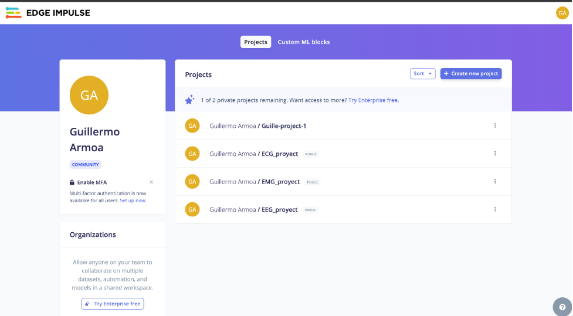
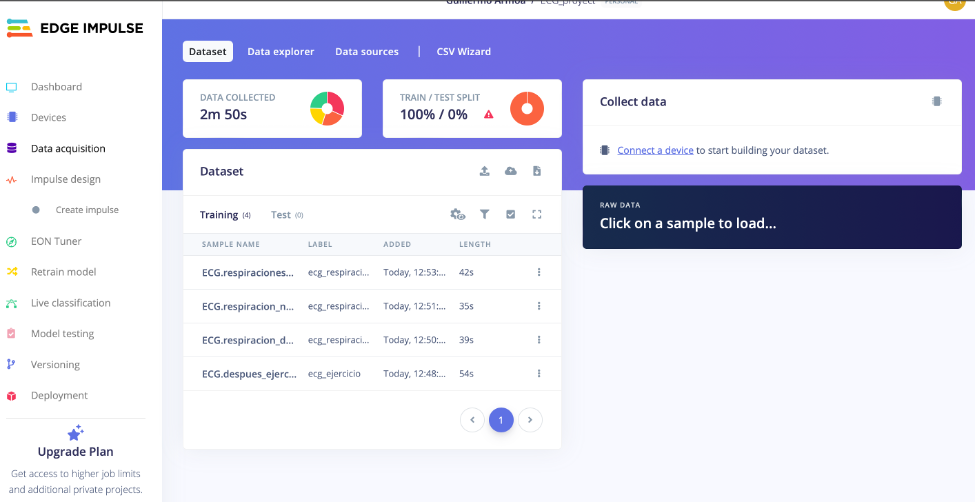
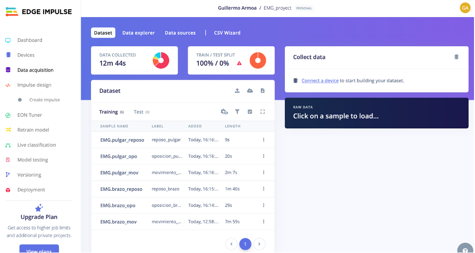
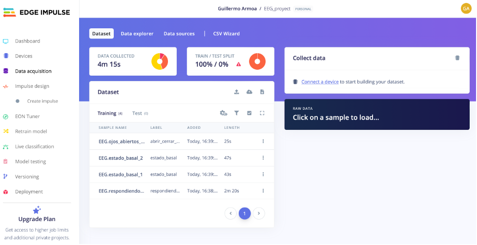

Para subir los archivos de las señales se crearon tres diferentes proyectos para cada señal. Como se observa en la Fig. 1, los proyectos son los siguientes: `ECG_proyect`, `EMG_proyect` y `EEG_proyect`. Links de los proyectos:

- **ECG**: [https://studio.edgeimpulse.com/public/431240/live](https://studio.edgeimpulse.com/public/431240/live)
- **EMG**: [https://studio.edgeimpulse.com/public/431242/live](https://studio.edgeimpulse.com/public/431242/live)
- **EEG**: [https://studio.edgeimpulse.com/public/431310/live](https://studio.edgeimpulse.com/public/431310/live)

Fig. 1. Proyectos creados para las tres señales

Para subir los archivos en cada proyecto, se utilizó el código de Python del [ejemplo que se brinda en la página de Edge Impulse](https://docs.edgeimpulse.com/reference/data-ingestion/ingestion-api). Para ello, se requiere que los archivos que se encuentran en formato `.txt` se transformen a formato `.csv`, el cual es compatible con Edge Impulse. Se utilizó un código de Python para transformar estos archivos y añadir una columna de tiempo, en este caso `timestamp`, que nos indica el tiempo en ms de la señal. En las Fig. 2, 3 y 4 se observan los archivos subidos en cada proyecto de acuerdo al tipo de señal.

Fig. 2. Archivos subidos en el proyecto ECG

Fig. 3. Archivos subidos en el proyecto EMG

Fig. 4. Archivos subido en el proyecto EEG
