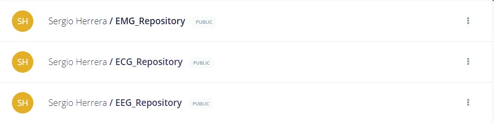
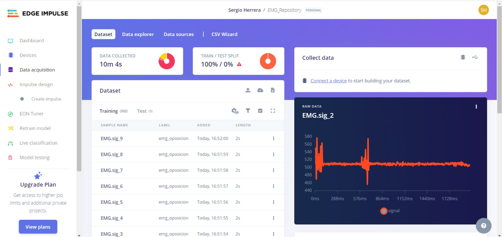
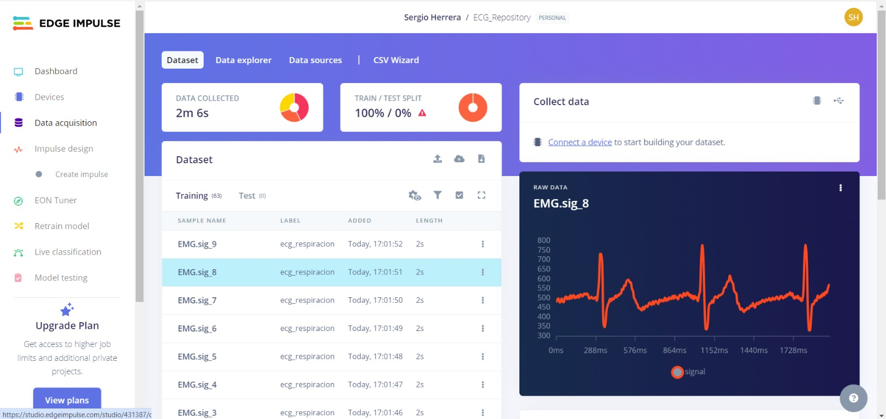
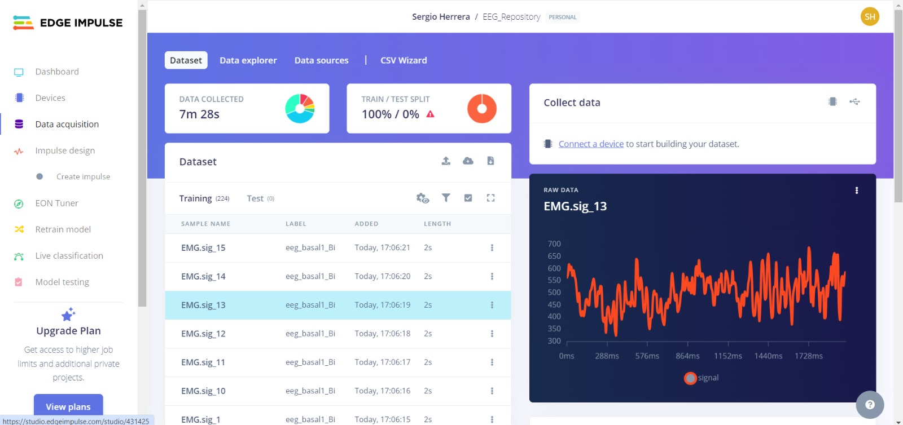

# Subida de Datos a Edge Impulse

## ¿Qué es Edge Impulse?

[Edge Impulse](https://www.edgeimpulse.com/) es una plataforma líder en el desarrollo de aprendizaje automático para dispositivos IoT y aplicaciones embebidas. Proporciona herramientas que permiten a los desarrolladores crear, entrenar y desplegar modelos de inteligencia artificial directamente en dispositivos embebidos, como microcontroladores y sensores. Edge Impulse facilita el procesamiento de datos y el desarrollo de modelos de machine learning optimizados para ejecutar en el edge, es decir, en el propio dispositivo, reduciendo la necesidad de depender de conexiones a la nube.

## Descripción del Proyecto

Este proyecto incluye un script en Python para leer datos de un archivo `.txt` de OpenSignals, procesar estos datos para identificar la señal que más varía, realizar un ventaneo de los datos y generar archivos CSV. Finalmente, los archivos CSV generados se suben a Edge Impulse para su posterior procesamiento.

    

### Origen de los Datos

Los datos utilizados en este proyecto provienen de los laboratorios 3, 4 y 5 de ECG, EMG y EEG.

### Estructura del Proyecto

- `read_opensignals_txt_file(file_path)`: Función para leer el archivo `.txt` y procesar los datos.
- `find_most_varying_signal(data)`: Función para identificar la señal que más varía en los datos.
- `create_csv_windows(data, signal_index, window_size, output_folder)`: Función para crear ventanas de datos y generar archivos CSV.
- `upload_files_to_edge_impulse(api_key, label, folder_path)`: Función para subir los archivos CSV generados a Edge Impulse.

### Requisitos

- Python 3.x
- Librerías: `numpy`, `matplotlib`, `requests`, `csv`

### Códigos de Python (Notebooks)

[Codigo OpenSignals](../Sergio_Herrera/Laboratorio14_SergioH/CodigoLab14_1.ipynb)

[Codigo OpenBCI](../Sergio_Herrera/Laboratorio14_SergioH/CodigoLab14_2_OpenBCI.ipynb)

### Enlaces de Edge Impulse (Dataset)

- EMG: https://studio.edgeimpulse.com/public/431217/live

    

- ECG: https://studio.edgeimpulse.com/public/431387/live

    

- EEG: https://studio.edgeimpulse.com/public/431425/live

    

