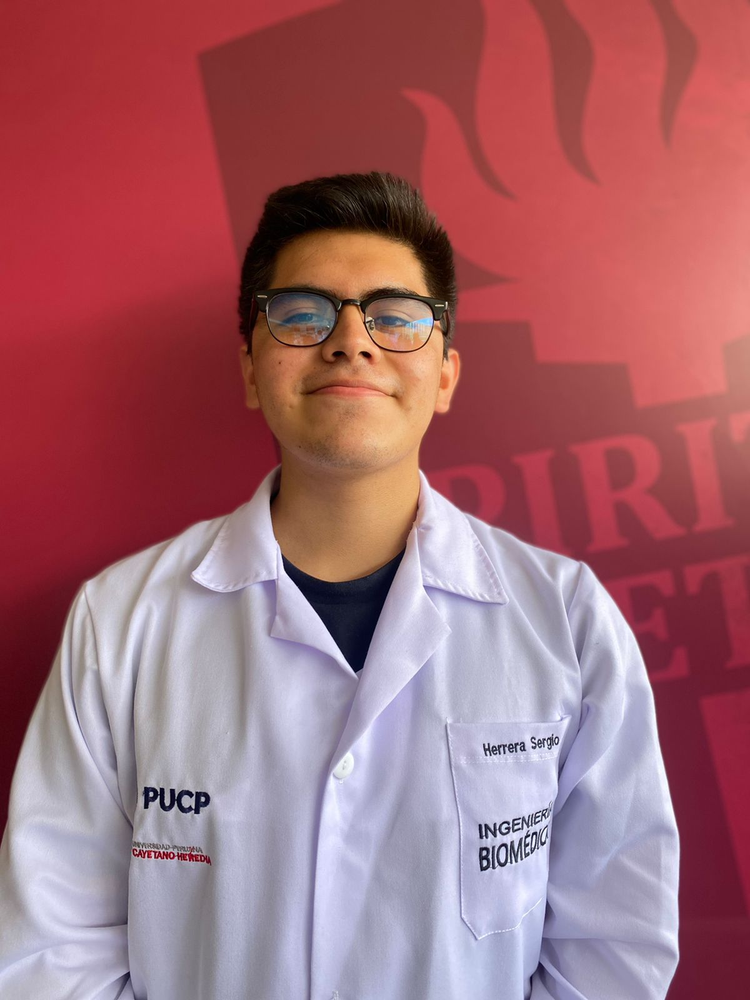
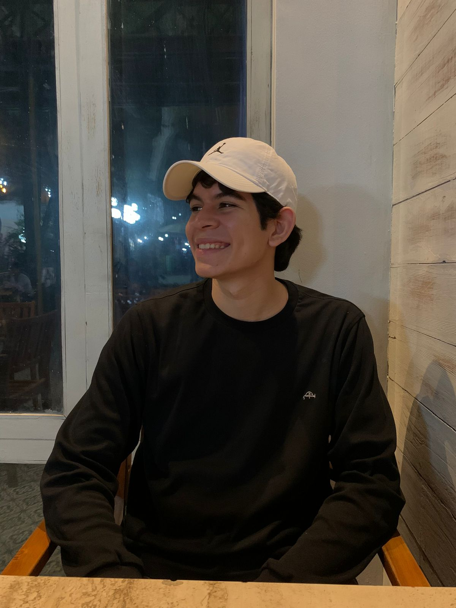

## Participantes

- Herrera del Carpio Sergio Jesús Miguel
    
    Estudiante de séptimo ciclo de Ingeniería Biomédica, interesado en el área de Señales e Imágenes Médicas, Electrónica, Ingeniería de Tejidos y Biomecánica.   
    (sergio.herrera@upch.pe)

    

        
    

 
 

- Jaico Roman Maria José   

    Estudiante de séptimo ciclo de Ingeniería Biomédica, interesada en el área de Ingeniería de Tejidos y Biomateriales, biotecnología, biología molecular y sintética.\
    (maria.jaico@upch.pe)

    

        
    

 
 

- Armoa Britez Guillermo Javier 

    Estudiante de séptimo ciclo de Ingeniería Biomédica, interesado en el área de Biología, Biología Molecular, Ingeniería de Tejidos, Biomateriales y Electrónica.

     (guillermo.armoa@upch.pe)
    

        
    

 
 

- Woll Garcia Alberto Gianfranco 

    Estudiante de séptimo ciclo de Ingeniería Biomédica, interesado en el área de Diseño de Circuitos, biotecnología, Ingeniería molecular, Procesamiento de Imágenes y Mecánica de Fluidos. 
    
    (alberto.woll@upch.pe)
    

        
    

