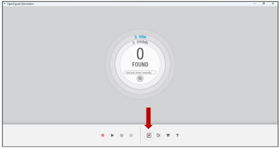
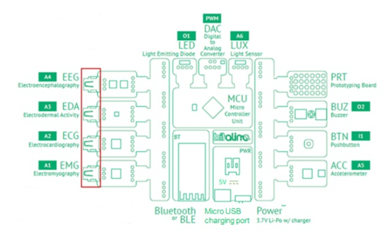
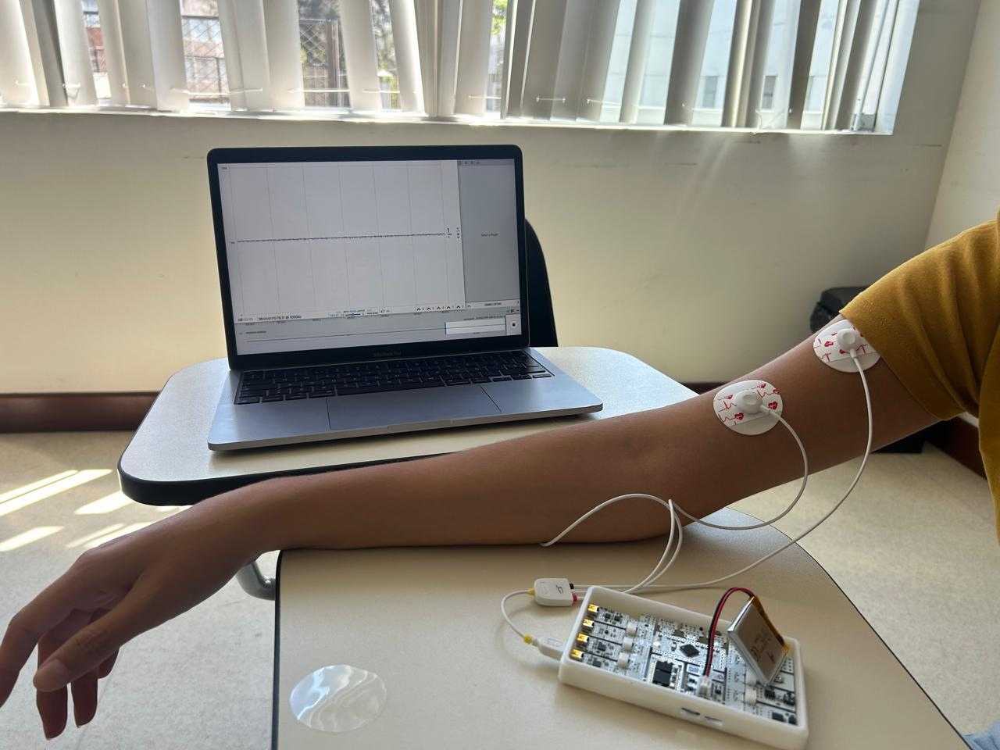
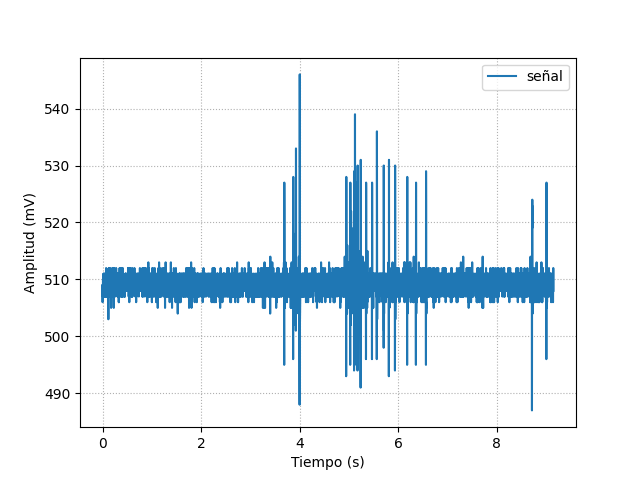
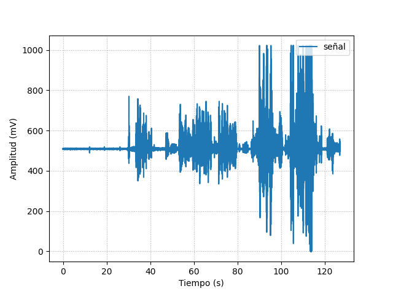
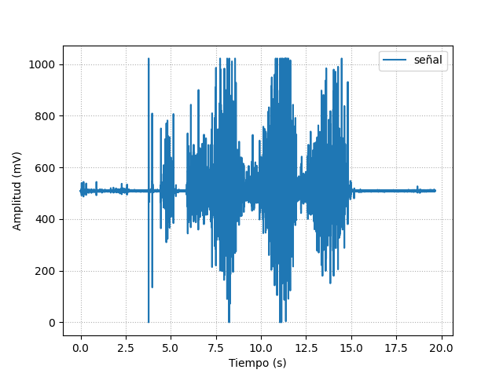

# LABORATORIO 3: Uso de BiTalino y Adquisición de Señales EMG

## Tabla de contenidos
1. [Objetivos](#objetivos)
2. [Materiales y equipos](#materiales-y-equipos)
3. [Procedimiento](#procedimiento)
4. [Entregables](#entregables)
   - 4.1 [Señales del Biceps](#41-posicionamiento-1-biceps)
   - 4.2 [Señales del Dedo Pulgar](#42-posicionamiento-2-pulgar)

## Objetivos
- Adquirir señales biomédicas de EMG.
- Hacer una correcta configuración de BiTalino.
- Extraer la información de las señales EMG y ECG del software OpenSignals (r)evolution.

## Materiales y equipos
| MODELO | DESCRIPCIÓN               | CANTIDAD |
|--------|---------------------------|----------|
| ( R ) EVOLUTION | Kit BITalino     | 1        |
|        | Laptop o PC               | 1        |

## Procedimiento
### 3.1 Instalación de OpenSignals
- Instalar OpenSignals (R)evolution: [Descarga aquí](https://www.pluxbiosignals.com/collections/bitalino/products/bitalino-revolution-boardkit-ble-bt)
- Descargar la versión de 64 bits.
### 3.2 Conexión del BITalino con OpenSignals
1. Activar el Bluetooth para configurar la tarjeta BITalino.
2. Conectar la batería a la placa BITalino.
3. Encender la placa.

   

    
    
Fig 1. Manual de BiTalino

4. Buscar la tarjeta BITalino.
   

    
      
Fig 2. Pantalla de Inicio OpenSignals
 

5. Agregar el pin “1234” que se muestra en la guía de inicio rápido.

6. Una vez listo, aparecerá de color azul la opción Enable en OpenSignals, lo que indica que el BITalino está listo para usarse.

7. Conectar los cables a A1, que es el puerto para Electromiografía (EMG). 
   

    
      
Fig 3. Canales del BiTalinmos. Canal A1
 

8. Colocar los electrodos en los cables y posicionarlos en el lugar de la medición.

### 3.2 Posicionamiento de los electrodos
- Se emplearon las posiciones referentes de electromiografía otorgadas por la guía para realizar la colocación de electrodos en el bíceps y en los músculos tenares ubicados debajo del pulgar.

## Entregables
### 4.1 Señal de Biceps
- Fotos conexión usada (Electrodos,cuerpo y bitalino).
   

    
   
Fig 4. Conexiones del bícep
 

- Videos:
   - Video de señal en silencio eléctrico o reposo.  
    
   
   - Video de señal en flexión y extensión.
   
   
   - Video de señal con fuerza de oposición.
   

- Ploteo en OpenSignals.

- Resumen y explicación de la señal proteada

- Archivos de los datos de las señales

- Ploteo cada señal en (Python)

### 4.2 Señal de Pulgar
- Fotos conexión usada.

- Videos:
   - Video de señal en silencio eléctrico o reposo
   
   - Video de señal en flexión y extensión.
    
   - Video de señal con fuerza de oposición.
   
- Ploteo en OpenSignals.

- Resumen y explicación de la señal proteada

- Archivos de los datos de las señales

- Ploteo de cada señal (Python).

  
  
Ploteo en Python Pulgar Reposo  

  
  
Ploteo en Python Pulgar Flexión y extensión  

  
  
Ploteo en Python Pulgar Oposición

### Ploteo de la señal del dedo gordo en reposo

### 4.3 Resumen Laboratorio y Discusión
En el laboratorio de Introducción a Señales Biomédicas, se realizó la medición de la actividad muscular mediante un electromiógrafo con electrodos superficiales. Se identificó una correlación positiva entre la fuerza muscular y el voltaje registrado, evidenciando un aumento proporcional en el voltaje conforme aumentaba la fuerza muscular. Durante el estudio, se efectuaron tres tomas de señal: en reposo, durante movimientos leves y al aplicar resistencia. En las gráficas resultantes, se observaron distintos patrones de actividad muscular: en reposo se identificó una línea de base estable, durante movimientos leves se registró un incremento correspondiente a la actividad muscular del movimiento ejecutado, y al aplicar resistencia se evidenció una mayor actividad muscular, reflejada en picos más pronunciados y una amplitud mayor. Además, se mostró la colocación de los electrodos del EMG en el músculo abductor pollicis brevis y el bíceps, permitiendo visualizar el estado relajado y la contracción muscular en distintas condiciones.
