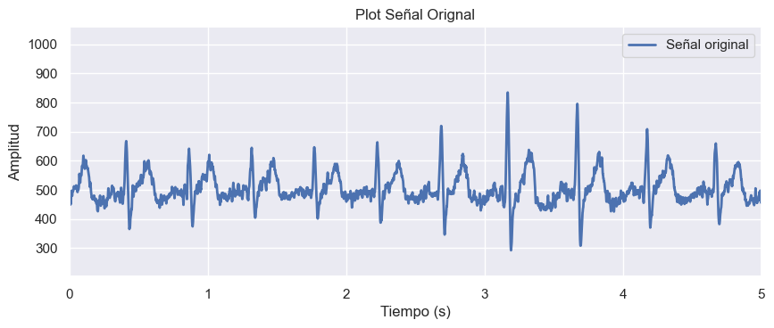
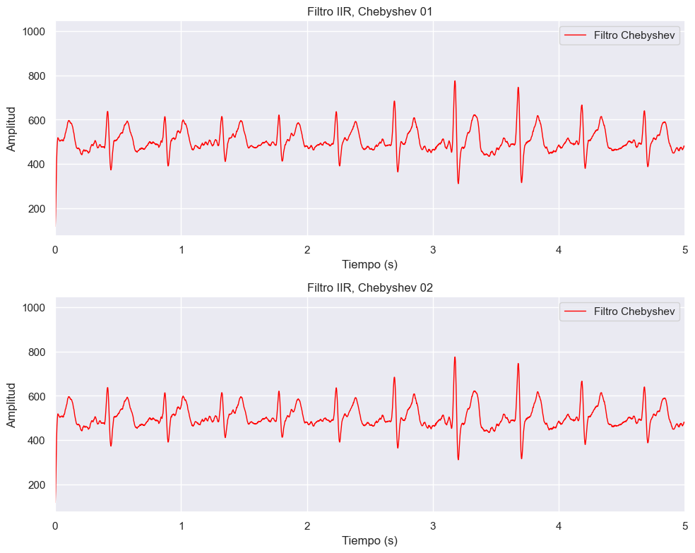
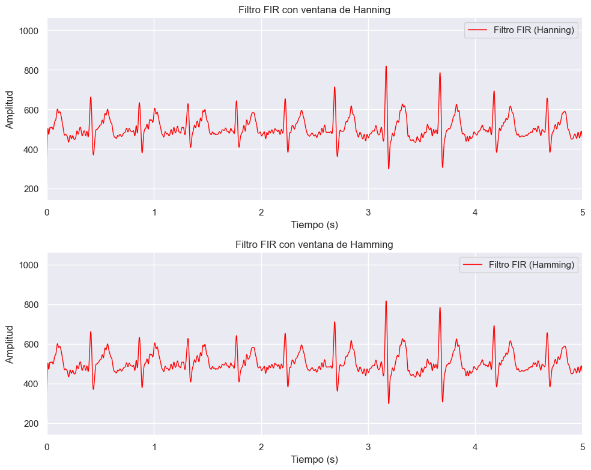

# LABORATORIO Nº 6 - FILTROS IIR Y FIR

## Introducción

El procesamiento de las señales biológicas en el cuerpo humano requiere de un procesamiento para extraer la información relevante de la señal. Un avance importante en el procesamiento de señal se dió con la aparición de filtros digitales. Estos filtros, pueden ser de respuesta finita al impulso (FIR) o de respuesta infinita al impulso (IIR), y son importantes para la obtención de información de las señales, que pueden ser biológicas y relevantes en contexto biomédicos y de investigación [1].

Un filtro digital es un sistema en el que se procesa una señal de entrada para producir una señal de salida, normalmente este filtro modifica la señal de entrada para obtener una señal de salida con las características deseadas. Los cambios pueden ser en su amplitud, fase o frecuencia. Los filtros FIR e IIR son ejemplos de filtros digitales que presentan sus propias aplicaciones y características [2].

Los filtros FIR, como indica su nombre, tiene una respuesta finita al impulso, esto quiere decir que la salida depende de una cantidad finita de muestras de entrada y sus coeficientes de filtro. Por lo tanto, lo hace adecuado para aplicaciones donde se requiere una respuesta de fase lineal y predecible, como lo pueden ser las señales de electrocardiograma (ECG) y electromiograma (EMG) [3].

Por otro lado, los filtros IIR presentan una respuesta infinita, utilizan un tipo de  retroalimentación en su estructura y tienen una respuesta al impulso de duración infinita. Debido a esto, los filtros IIR presentan un rendimiento en cuanto a eficiencia computacional, por ello son utilizados para aplicaciones donde se necesitan transiciones de frecuencia más suaves, como en el filtrado de señales de electroencefalograma (EEG) [4].

La aplicación de filtros digitales en el procesamiento de señales biomédicas es amplia y variada. Se puede utilizar para eliminar artefactos y ruido, también la detección de eventos y la extracción de características relevantes, los filtros digitales son herramientas importantes para mejorar la precisión y fiabilidad de las mediciones biomédicas, en consecuencia es fundamental en el diagnóstico, tratamiento y monitoreo de diversas afecciones médicas [1].

## Objetivos

- Filtrar las señales EMG para eliminar ruido y artefactos, y aislar la actividad muscular efectiva.
- Filtrar las señales ECG para reducir el ruido y tratar de conseguir la mejor visualización para la actividad eléctrica cardíaca. 
- Preprocesar señales EEG para reducir el ruido y extraer características de interés como ondas cerebrales específicas.

## Metodología

En base a los dataset recopilados en los anteriores laboratorios: EMG, ECG y EEG, se aplicarán filtros digitales para mejorar la calidad de las señales biomédicas. Se realizarán tres ejercicios, cada uno de ellos implica el diseño de un filtro IIR y un filtro FIR, con especificaciones determinadas, y la presentación de los resultados en una tabla resumen, seguido de la documentación en el repositorio GitHub.

### Ejercicio de Laboratorio para señales ECG

Diseñar un filtro IIR, elegir entre los siguientes tipos de filtros: Bessel, Butterworth, Chebyshev o Elíptico.

Diseñar un filtro FIR, elegir entre los siguientes tipos de ventana: Hanning, Hamming, Bartlett, rectangular o Blackman.

Las características para ambos filtros son las siguientes: 
- Fc = 20 Hz
- Wp = 94 rad/s
- Ws = 157 rad/s

### Ejercicio de Laboratorio para señales EMG

Diseñar un filtro IIR, elegir entre los siguientes tipos de filtros: Bessel, Butterworth, Chebyshev o Elíptico.  Eliminar frecuencias altas que correspondan a ruido eléctrico y artefactos de movimiento.  Las características para dicho filtro son las siguientes:
- Fc = 60 Hz 
- Wp = 188 rad/s
- Ws = 300 rad/s

Diseñar un filtro FIR, elegir entre los siguientes tipos de ventana: Hamming y Blackman. Aislar la banda de frecuencia de interés que corresponde a la actividad muscular. Las características para dicho filtro son las siguientes:
- Fc = 40 Hz
- Tipo de filtro: Pasa banda bajo

### Ejercicio de Laboratorio para señales EEG

Diseñar un filtro IIR, elegir entre los siguientes tipos de filtros: Bessel, Butterworth, Chebyshev o Elíptico. Suprimir la interferencia de frecuencia alta y artefactos. Las características para dicho filtro son las siguientes: 
- Fc = 30 Hz 
- Wp = 94 rad/s
- Ws = 157 rad/s

Diseñar un filtro FIR, elegir entre los siguientes tipos de ventana: Hamming y Blackman.  Extraer bandas de frecuencia específicas (alfa, beta, etc.). Las características de dicho filtro son las siguientes:
- Fc = 12 Hz
- Tipo de filtro: Paso banda para ondas alfa. 

## Resultados
### Tabla EMG
| Campo              | Señal Cruda             | Señal filtrada con filtro IIR | Señal filtrada con filtro FIR |
|--------------------|-------------------------|-------------------------------|-------------------------------|
| Descanso - Basal  |  |  | 
| Contracción débil |  |  | |
| Contracción fuerte|  |  |  |
#### Códigos
- [Descanso - Basal](../../Software/Lab6/brazo_reposo.py)
- [Contracción débil](../../Software/Lab6/brazo_movimiento.py)
- [Contracción fuerte](../../Software/Lab6/brazo_oposicion.py)

### Tabla ECG
| Campo          | Señal Cruda             | Señal filtrada con filtro IIR | Señal filtrada con filtro FIR | 
|----------------|-------------------------|-------------------------------|-------------------------------|
| Basal          |  |  |  |
| Post Ejercicio |  |  |  |
| Respiración - Post Ejercicio |  |  |  |
#### Códigos
- [Basal](../../Software/Lab6/ECG_respiracion_normal_filter.ipynb)
- [Post Ejercicio](../../Software/Lab6/ECG_despues_ejercicio_filters.ipynb)
- [Respiración -Post Ejercicio](../../Software/Lab6/ECG3_respiracion_despues_ejercicio_filter.ipynb)

### Tabla EEG
| Campo              | Señal Cruda             | Señal filtrada con filtro IIR | Señal filtrada con filtro FIR |
|--------------------|-------------------------|-------------------------------|-------------------------------|
| Basal   |  |  | 
| Ojos abiertos- cerrados  |  |  | |
| Ejercicios Mentales   |  |  |  |

#### Códigos
- [Basal](../../Software/Lab6/Estado_basal_IIR.py)
- [Ojos abierto - cerrados](../../Software/Lab6/ciclo_ojos_abiertos_cerrados_IIR.py)
- [Ejercicios Mentales](../../Software/Lab6/ejercicio_mental_IIR.py)

## Discusión
Los filtros FIR son una clase esencial de filtros digitales que se caracterizan por tener una respuesta al impulso de duración finita. Esto significa que su salida depende únicamente de una suma ponderada de valores de entrada anteriores, sin considerar valores previos de salida, a diferencia de los filtros IIR. Además, los filtros FIR son siempre estables y relativamente fáciles de diseñar e implementar en hardware digital. Sin embargo, a menudo requieren un orden de filtro más alto que los filtros IIR para lograr un rendimiento similar, lo que puede resultar en un mayor retardo y una mayor complejidad computacional. [5]

En las gráficas de ECG, se observa el filtrado de la señal mediante dos tipos de filtros Chebyshev con los que se pudo obtener un mejor resultado, comparado con el filtro FIR implementado. Según los hallazgos de un estudio los filtros IIR [6], especialmente el filtro Chebyshev tipo II, son más efectivos y eficientes que los filtros FIR para eliminar el ruido de las señales de ECG, esto concuerda con lo obtenido con en las gráficas.

Los filtros FIR son estables y tienen una respuesta de fase lineal, no pueden suprimir el ruido de manera efectiva, incluso con un orden de filtro alto de 50. Sin embargo, se sugiere combinar ambos tipos de filtros con otras técnicas avanzadas de eliminación de ruido para manejar mejor los ruidos con espectros superpuestos [6].

## Bibliografía

[1] W. J. Tompkins, "Introduction to Computers in Medicine," en "Procesamiento Digital de Señales Biomédicas," Prentice Hall, Upper Saddle River, NJ, 2000, pp. 1-23. 

[2] Nair, B. S. (2004). Digital signal processing: Theory, analysis and digital-filter design. PHI Learning Pvt. Ltd.

[3] Ozpolat, E., Karakaya, B., Kaya, T., & Gulten, A. (2016). FPGA-based digital Filter Design for Biomedical Signal. 2016 XII International Conference on Perspective Technologies and Methods in MEMS Design (MEMSTECH). doi:10.1109/memstech.2016.7507523 

[4] L. Dezhi, Z. Xintong and G. Xiaozhong, "Research on Multi-feature Extraction Method in EEG Signal of Motor Imagination," 2020 International Conference on Virtual Reality and Intelligent Systems (ICVRIS), Zhangjiajie, China, 2020, pp. 462-465, doi: 10.1109/ICVRIS51417.2020.00116.

[5] MathWorks. "FIR Filter Design." MATLAB Documentation. https://www.mathworks.com/help/signal/ug/fir-filter-design.html

[6] . M. Chieng, Y. W. Hau, and Z. Omar, "The Study and Comparison between Various Digital Filters for ECG De-noising," in 2018 IEEE-EMBS Conference on Biomedical Engineering and Sciences (IECBES), 2018, doi: 10.1109/iecbes.2018.8626661.
