# LABORATORIO Nº 7 - TRANSFORMADA WAVELET

## Introducción
La transformada wavelet (WT) se ha establecido como la solución más avanzada para las limitaciones de la transformada de Fourier. Las funciones wavelet están localizadas tanto en el espacio como en los dominios de frecuencia y suelen representar la escala de tiempo. En el ámbito de las señales biomédicas, la mayoría de las características estadísticas no son estacionarias [1].

La transformada wavelet ofrece un método alternativo para analizar señales biomédicas no estacionarias, proporcionando una resolución de tiempo-frecuencia variable en el plano tiempo-frecuencia [2]. Esta técnica descompone una señal biomédica en bandas de frecuencia que están localizadas en el tiempo y la frecuencia. A bajas frecuencias, el tamaño de la ventana es grande para detectar cambios abruptos, mientras que a altas frecuencias, el tamaño de la ventana es pequeño. La capacidad de localización de la transformada wavelet permite aislar singularidades y estructuras irregulares en la señal. Además, la transformada wavelet requiere menos espacio de almacenamiento en comparación con otros métodos de análisis de tiempo-frecuencia. En esta transformada, el tamaño y las dimensiones de la salida son casi iguales a las de la entrada, lo que es una característica ventajosa en el procesamiento de imágenes de señales biomédicas. La transformada wavelet se ha convertido en una técnica muy poderosa y reconocida en la detección de características, reducción de ruido y compresión de señales en el procesamiento de imágenes. [3]

## Objetivos
- Implementar la DWT en señales biomédicas
- Evaluar la efectividad de la DWT en la reducción de ruido
- Aprender a usar la transformada Wavelet en aplicaciones biomédicas usando correctamente los parámetros necesarios

## Metodología
En base a los dataset recopilados en los anteriores laboratorios: EMG, ECG y EEG, se aplicarán DWT  para mejorar la calidad de las señales biomédicas. la presentación de los resultados se dará en una tabla, seguido de la documentación en el repositorio GitHub.

### Para señales EMG:
- **Preprocesamiento:**
    - Según el paper buscado en la literatura de la clasificación de EMG usando DWT [4], este se basó en el movimiento de la mano. En nuestro caso, nos enfocaremos en el brazo, sin embargo, las recomendaciones de este paper son en base a los movimientos tanto de muñeca como dedos, así que hay que tomarlo como consideración.

    - La señal EMG inicial se filtra usando un filtro pasa banda en el rango de 5-160 Hz para eliminar el ruido y otras señales no deseadas. Esta etapa es crucial para mejorar la calidad de la señal y asegurar que los datos sean aptos para análisis posteriores. [4]

- **Transformada Wavelet Discreta (DWT):**

    - Se elige una wavelet madre adecuada para descomponer la señal EMG. En este caso, se utiliza la wavelet Daubechies db3, conocida por su capacidad para capturar características relevantes en señales biomédicas. [4]

- **Descomposición de la señal:**

    - La señal EMG se pasa a través de filtros pasa alto y pasa bajo secuencialmente para obtener coeficientes de detalle y aproximación en cada nivel de descomposición. Esto se repite hasta alcanzar el nivel deseado de descomposición. Para el análisis en el documento, se establece un nivel de descomposición de hasta 8, generando subconjuntos de coeficientes de detalle (cd1, cd2, cd3, cd4, cd5, cd6, cd7, cd8) y un coeficiente de aproximación. [4]

    - Para el umbral, nos basamos en una fórmula que también se realiza en otros papers para la Transformada de Wavelet [5]. Así pues nos deja completar el cálculo para efectuar este filtro a la señal original.

    

    
        
Figura 1. Ecuación para el Umbral [5]
    

### Para señales ECG:
- **Filtrado con Wavelet tipo db4:**
  - Se recomienda utilizar una wavelet tipo db4 para eliminar los componentes de alta frecuencia de la señal.
  - Se utilizan 8 niveles de descomposición para asegurar una eliminación efectiva de las frecuencias no deseadas. [6]
  - Se aplica una ventana de 5 segundos para el procesamiento de la señal en cada nivel de descomposición. [6]
  - Posteriormente, se realiza un filtrado de media móvil para eliminar los ruidos de bajas frecuencias y suavizar la señal. [6]

### Para señales EEG:

- **Preprocesamiento:**
    - Para la etapa de preprocesamiento se recomienda emplear un filtro pasabanda utilizando la respuesta al impulso infinita (IIR) de tipo Butterworth y orden 4. Las frecuencias de corte inferior y superior se han ajustado a 0,5 Hz y 35 Hz. Todo esto debido a que las señales de EEG contienen la mayor parte de la información valiosa en el rango de frecuencia por debajo de 35 Hz, por esta razón es necesario preprocesar la señal respectiva para eliminar los artefactos de ruido y preservar solo la información necesaria. [7]

-  **Descomposición de la señal y DWT**
  
La descomposición de la señal se llevó a cabo utilizando el tipo de wavelet "db4", según lo especificado en la bibliografía. La señal se dividió en 5 niveles de descomposición para su análisis.

Aunque no encontramos literatura explícita que recomiende el uso de la familia de wavelets "db4" en estudios que analicen la señal EEG en condiciones de ojos cerrados, estado basal y ejercicios mentales, nos basamos en la familia de wavelets utilizada en otros estudios similares. Por ejemplo, en el estudio titulado "Wavelet-based EEG processing for computer-aided seizure detection and epilepsy diagnosis", se menciona que se obtuvo la mayor precisión de clasificación utilizando la wavelet "db4". Además, se observa que "db4" es ampliamente utilizada no solo para la detección de convulsiones, sino también para el diagnóstico de epilepsia, Alzheimer y posiblemente otras enfermedades mentales.

Dada su eficacia demostrada en múltiples contextos de análisis EEG, incluyendo la detección de eventos anómalos y el diagnóstico de condiciones neurológicas, la familia de wavelets "db4" es considerada como una opción sólida y versátil en la investigación y práctica clínica. Por tanto, al utilizar EEG como herramienta de análisis, la elección de la wavelet "db4" se respalda tanto por su desempeño como por su amplia aceptación en la comunidad científica. [13]

- **Número de niveles de descomposición:**
    - Además, según la bibliografía la decisión de dividir la señal en 5 niveles de descomposición se fundamenta en la necesidad de capturar tanto los componentes de baja frecuencia como los de alta frecuencia de la señal EEG. [7][8].
    - Para la obtención del umbral global (Global Threshold) se aplicó la fórmula que se muestra a continuación: 

    TG =  σ * raiz(2 * log(N)) 

    σ = mediana(|w|) / 0.6745 

    - Donde: 
        - N = longitud de la señal 
        - w = coeficientes de wavelet (coef[-1] -> último coeficiente)
        - σ = varianza del ruido 

    - Para la eliminación de señales no deseadas se usaron técnicas de umbralización. El método de umbralización suave adaptativa permite eliminar el ruido presente en los coeficientes de detalle, que representan a las frecuencias más altas de la señal. El coeficiente de aproximación captura la estructura global de la señal, por lo cual no se le aplica este suavizado. [7]
    - Se tuvieron en cuenta distintas configuraciones en cuanto a la etapa de preprocesamiento, niveles de descomposición, familia wavelet y longitud de ventana que se recomendaban en la literatura. [7] [8]

## Resultados
### Tabla EMG:
| Campo              | Señal Cruda             | Señal filtrada con DWT       |
|--------------------|-------------------------|-------------------------------|
| Descanso - Basal  |  |  |
| Contracción débil |  |  |
| Contracción fuerte|  |  |

#### Códigos
- [Descanso - Basal](../../Software/Lab7/Brazo_basal.ipynb)
- [Contracción débil](../../Software/Lab7/Brazo_movimiento.ipynb)
- [Contracción fuerte](../../Software/Lab7/Brazo_oposicion.ipynb)

### Tabla ECG:
| Campo              | Señal Cruda             | Señal filtrada con DWT       |
|--------------------|-------------------------|-------------------------------|
| Descanso - Basal  | 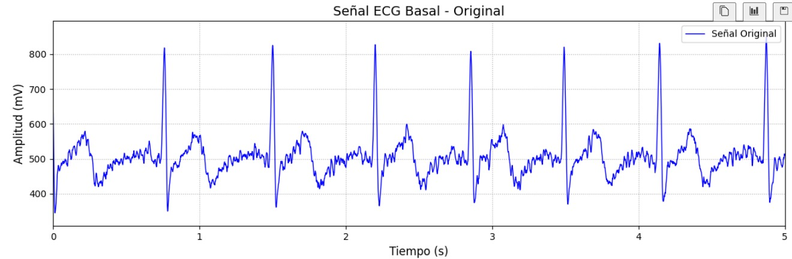 | 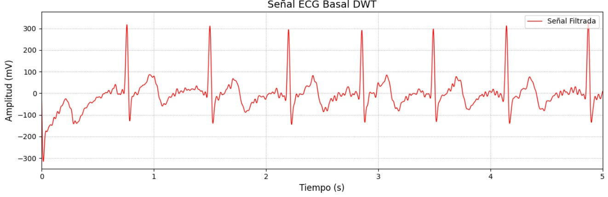 |
| Post Ejercicio | 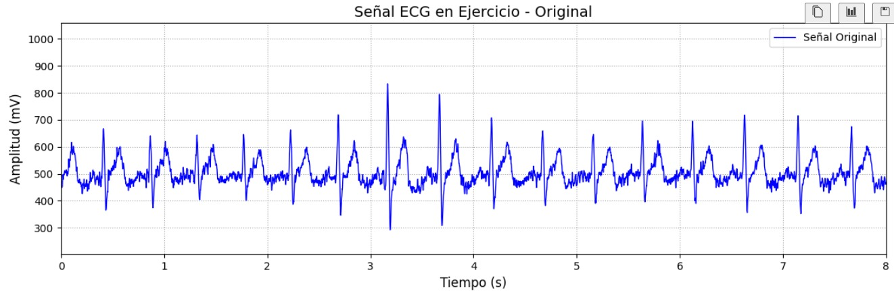 | 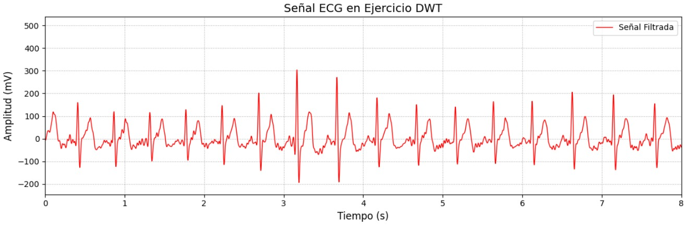 |
| Recuperación| 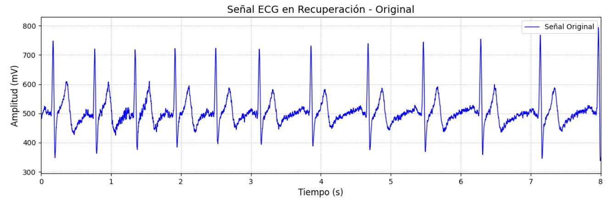 | 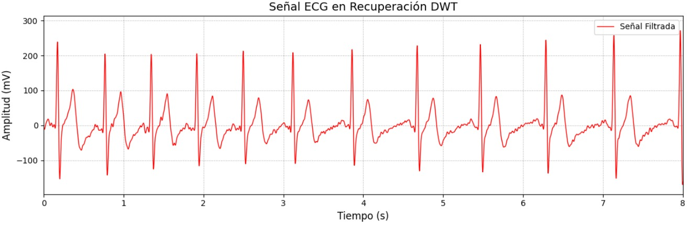 |

#### Códigos
- [Basal](../../Software/Lab7/ECG_Basal.ipynb)
- [Post Ejercicio](../../Software/Lab7/ECG_Ejercicio.ipynb)
- [Recuperación](../../Software/Lab7/ECG_recuperacion.ipynb)

### Tabla EEG:
| Campo              | Señal Cruda             | Señal filtrada con DWT       |
|--------------------|-------------------------|-------------------------------|
| Basal  | 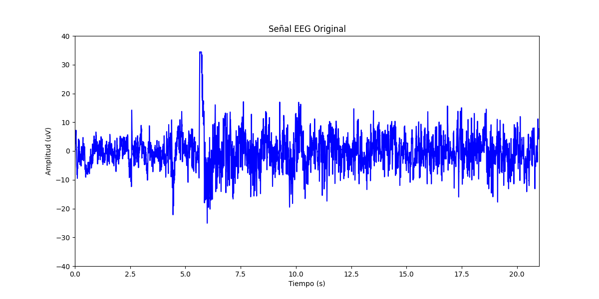 | 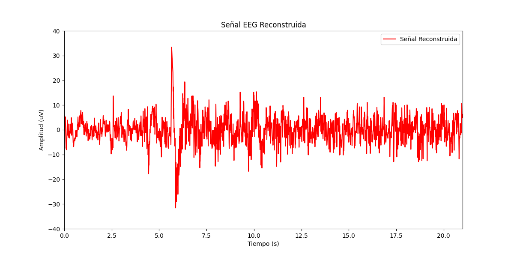 |
| Ojos abiertos - cerrados | 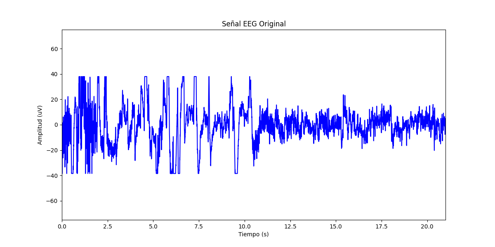 | 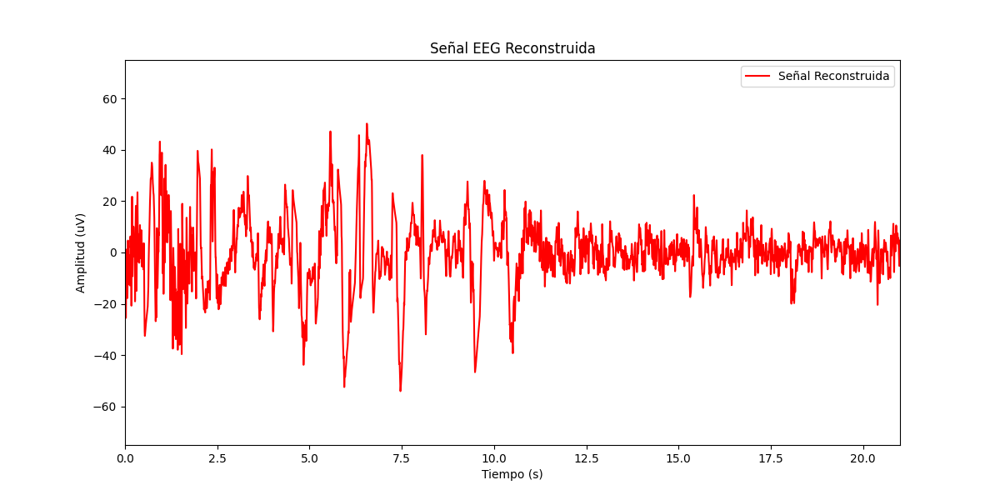 |
| Ejercicios Mentales| 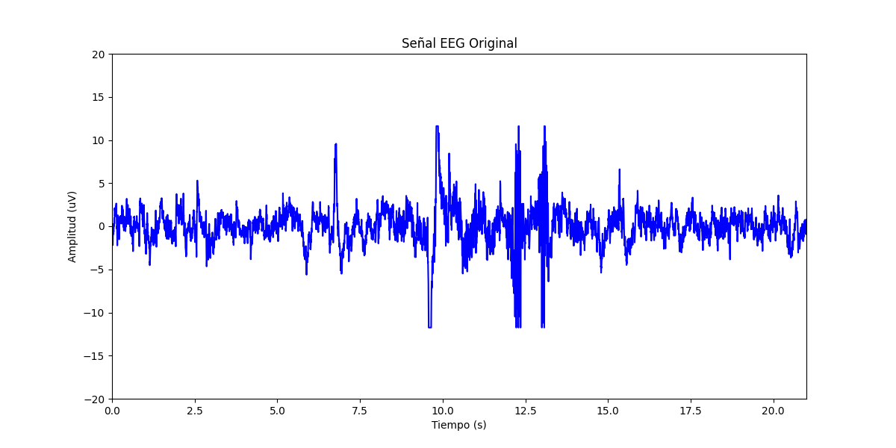 | 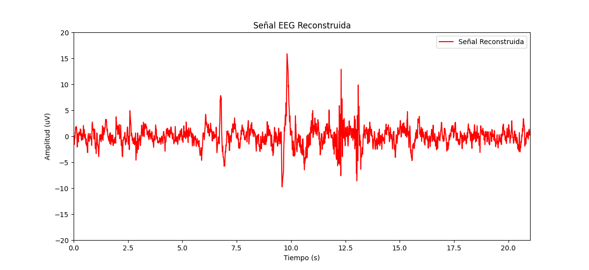 |

#### Códigos
- [Basal](../../Software/Lab7/estado_basal_wavelet.py)
- [Ojos abierto - cerrados](../../Software/Lab7/ojos_cerrados_wavelet.py)
- [Ejercicios Mentales](../../Software/Lab7/ejercicios_mentales_wavelet.py)

## Discusión y Conclusiones

### Para Señales EMG:
La aplicación de la Transformada Wavelet Discreta (DWT) en el análisis del reposo del brazo revela la capacidad de filtrar esta señal por sus coeficientes. Así se puede identificar patrones y tendencias tanto en el dominio del tiempo como en el de la frecuencia, lo que resulta útil para entender la actividad muscular en reposo. Se observa que durante el reposo del brazo, las componentes de baja frecuencia son predominantes, mientras que las de alta frecuencia contribuyen mínimamente a la información relevante de la señal.

Al aplicar la DWT al análisis del movimiento del brazo, se destaca su capacidad para discernir entre los diferentes niveles de esfuerzo muscular que realiza. La descomposición en coeficientes de detalle y aproximación permite capturar las características globales de la señal como los detalles finos relacionados con la fuerza y la dirección del movimiento. Se observan movimientos en la amplitud más grandes que en reposo.

En el caso del movimiento de oposición del brazo con mayor fuerza, la aplicación de la DWT revela cambios significativos en las características de la señal sEMG en comparación con otros movimientos, existen ondas más pronunciadas y resaltan más otros tipos de onda que en los que se presentan únicamente los de movimiento o reposo.

En general, basado en los resultados obtenidos, se evidencia que el proceso de descomposición de la señal mediante la DWT proporciona información detallada sobre la actividad muscular durante diferentes tipos de movimientos del brazo. La capacidad de la DWT para identificar patrones y tendencias en las señales sEMG puede ser de gran utilidad en aplicaciones de rehabilitación y control de prótesis. [4].

En conclusión, este laboratorio nos enseñó a destacar el potencial de la DWT como una herramienta de análisis de señales sEMG para aplicaciones de movimiento del brazo.

### Para Señales ECG:
En ingeniería biomédica, el electrocardiograma (ECG) es una herramienta crucial para monitorear las señales del corazón [9]. Sin embargo, las señales de ECG a menudo contienen ruido, lo que complica su análisis. La transformada wavelet es una herramienta para procesamiento de señales biomédicas, debido a que proporciona información tanto en el dominio del tiempo como en el de la frecuencia, por lo que es ideal para analizar señales no estacionarias como el ECG. La transformada wavelet se utiliza para reducir el ruido en las señales de ECG y mejorar la detección de eventos cardíacos clave como los complejos QRS, las ondas P y las ondas T [10].

Se observa que, con la aplicación de la transformada wavelet, las señales de ECG mejoraron en la claridad de la señal. Al seleccionar funciones wavelet y niveles de descomposición de acuerdo a [11], aislamos y eliminamos el ruido mientras preservábamos las características cardíacas esenciales. Esto mejoró la visibilidad de los complejos QRS, las ondas P y las ondas T, facilitando una interpretación más precisa. Comparando con el resultado obtenido en con el método aplicado anteriormente en laboratorio de filtros FIR e IR, se obtuvieron mejores resultados.

Además, el enfoque basado en wavelets mejora la relación señal-ruido, este método podría aumentar la precisión de los sistemas de análisis automático de ECG, llevando a mejores resultados diagnósticos [12]. Los resultados apoyan el uso y desarrollo continuado de técnicas wavelet en el procesamiento de señales biomédicas, especialmente para aplicaciones que requieren un análisis temporal y espectral preciso.

### Para Señales EEG:
La eliminación de artefactos puede realizarse siguiendo dos metodologías. La primera, se basa en aplicar DWT a la señal EEG y eliminar los coeficientes que están por encima de un umbral establecido para al final reconstruir la señal utilizando DWT inverso. La segunda opción, es aplicar un suavizado de coeficientes siguiente un umbral (threshold), los dos umbrales más utilizados con wavelets son el umbral global y el umbral de desviación estándar (STD)  [14]. Además, una tercera opción es utilizar el algoritmo de eliminación automática y sintonizable de artefactos (ATAR) que funciona mejor que ICA, se basa en la descomposición de paquetes Wavelets, proporciona parámetros de ajuste y diferentes modo de operación que le permiten controlar la agresividad del algoritmo ICA. [15]  

La adquisición de las señales EEG, se realizó siguiendo un protocolo de preguntas [16] y mediante ciclos de ojos abiertos y cerrados. Del estudio del que se basó el protocolo de preguntas, se obtuvo una potencia absoluta más alta de theta y alfa cuando los participantes resolvían problemas más complejos, lo cual demostró el requerimiento de la activación prefrontal. Asimismo, en un estudio utilizaron los datos EEG para predecir el estado de los ojos (abiertos o cerrados), debido a que se puede analizar las características de la señal EEG a diferentes frecuencias emplearon la transformada de Wavelet para la extracción de estas características. [17]

## Bibliografía

[1]. Y. Attikiouzel, ‘Biomedical signal processing: present and future’, Proceedings of the 5th International Symposium on Signal Processing and Its Applications, ISSPA’99, vol. 1, 1999.

[2]. I. Daubechies, ‘Orthonormal bases of compactly supported wavelets’, Communications on Pure and Applied Mathematics, vol. 41, no. 7, pp. 909–996, 1988.

[3]. F. Abramovich, T. C. Bailey, and T. Sapatinas, ‘Wavelet analysis and its statistical applications’, Journal of the Royal Statistical Society: Series D (The Statistician), vol. 49, no. 1, pp. 1–29, 2000.

[4] Aljebory, Karim & Jwmah, Yashar & Mohammed, Thabit. (2024). Classification of EMG Signals Using DWT Features and ANN Classifier. 51. 23-32. [PDF web](https://www.iaeng.org/IJCS/issues_v51/issue_1/IJCS_51_1_04.pdf) or [PDF](../../Documentacion/Laboratorios/Lab7_DWT/Classification%20of%20EMG%20Signals_Using%20DWT%20Features%20and%20ANN%20Classifier.pdf)

[5] M. Boyer, L. Bouyer, J.-S. Roy, and A. Campeau-Lecours, “Reducing noise, artifacts and Interference in Single-Channel EMG Signals: a review,” Sensors, vol. 23, no. 6, p. 2927, Mar. 2023, [doi: 10.3390/s23062927](https://doi.org/10.3390/s23062927). or [PDF](../../Documentacion/Laboratorios/Lab7_DWT/EMG_Wavelet_Paper2.pdf)

[6] R. Singh, R. Mehta, and N. Rajpal, ‘Efficient wavelet families for ECG classification using neural classifiers’, Procedia Comput. Sci., vol. 132, pp. 11–21, 2018.

[7] M. Sharma, V. Patel, J. Tiwari, and U. R. Acharya, ‘Automated characterization of cyclic alternating pattern using wavelet-based features and ensemble learning techniques with EEG signals’, Diagnostics (Basel), vol. 11, no. 8, p. 1380, 2021.

[8] S. Mohammady, Wavelet Theory. 2021, pp. 105–101. [PDF](../../Documentacion/Laboratorios/Lab7_DWT/Wavelet_Theory.pdf)

[9] Selcan Kaplan Berkaya, et al. "A survey on ECG analysis," Biomedical Signal Processing and Control, vol. 43, pp. 216-235, 2018.

[10] S. Goel, P. Tomar, and G. Kaur, "An optimal wavelet approach for ECG noise cancellation," International Journal of Bio-Science and Bio-Technology, vol. 8, no. 4, pp. 39-52, 2016.

[11] P. M. Shemi and E. M. Shareena, "Analysis of ECG signal denoising using discrete wavelet transform," in 2016 IEEE International Conference on Engineering and Technology (ICETECH), Coimbatore, India, 2016, pp. 713-718.

[12] M. E. Alexander, R. Baumgartner, A. R. Summers, C. Windischberger, M. Klarhoefer, E. Moser, and R. L. Somorjai, "A wavelet-based method for improving signal-to-noise ratio and contrast in MR images," Magnetic Resonance Imaging, vol. 18, no. 2, pp. 169-180, 2000, doi: 10.1016/S0730-725X(99)00128-9. [Online]. Available: [https://www.sciencedirect.com/science/article/pii/S0730725X99001289](https://www.sciencedirect.com/science/article/pii/S0730725X99001289)

[13] O. Faust, U. R. Acharya, H. Adeli, and A. Adeli, ‘Wavelet-based EEG processing for computer-aided seizure detection and epilepsy diagnosis’, Seizure, vol. 26, pp. 56–64, 2015.

[14] S. Mohammady, Wavelet Theory. 2021, pp. 105–101.

[15] N. Bajaj, J. Requena Carrión, F. Bellotti, R. Berta, and A. De Gloria, “Automatic and tunable algorithm for EEG artifact removal using wavelet decomposition with applications in predictive modeling during auditory tasks,” vol. 55. Elsevier BV, 01-Jan-2020.

[16] “EEG correlation during the solving of simple and complex logical–mathematical problems | Cognitive, Affective, & Behavioral Neuroscience” [Online]. Available: https://link.springer.com/article/10.3758/s13415-019-00703-5. [Accessed: 17-May-2024]

[17] P. Ma and Q. Gao, “EEG Signal and Feature Interaction Modeling-Based Eye Behavior Prediction Research,” vol. 2020, p. 2801015, May 2020, doi: 10.1155/2020/2801015. [Online]. Available: https://www.ncbi.nlm.nih.gov/pmc/articles/PMC7246416/. [Accessed: 17-May-2024]

