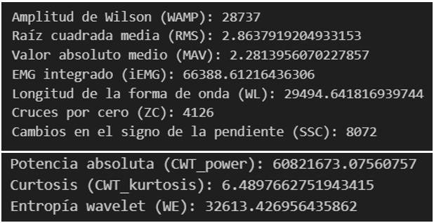

# LAB 8 - PROCESAMIENTO EMG

## TABLA DE CONTENIDOS 
1. [Objetivos](#objetivos)
2. [Materiales](#materiales)
3. [Introducción](#introducción)
4. [Resultados](#resultados)
    - 4.1 [Filtrado](#41-filtrado)
    - 4.2 [Gráficas de Bode (filtros)](#42-gráficas-de-bode-filtros)
    - 4.3 [Segmentación](#43-segmentación)
    - 4.4 [Extracción de características](#44-extracción-de-características)
5. [Discusión de resultados](#discusión-de-resultados)
    - 5.1 [Selección del mejor filtro](#51-selección-del-mejor-filtro)
6. [Referencias](#referencias)

---

## Objetivos 
- Eliminar el ruido y artefactos de la señal EMG mediante diferentes filtros.
- Identificar el mejor filtro para la señal EMG.
- Dividir la señal en ventanas de tiempo para su posterior análisis.
- Extraer características relevantes de las señales EMG.

## Materiales 
- Señales EMG en reposo y en contracción.
- Visual Studio Code.

## Introducción
El procesamiento de señales EMG es de vital importancia para un correcto análisis y extracción de características que permitan describir la actividad eléctrica de los músculos; así como mejorar la calidad de la señal obtenida. En este laboratorio procesaremos señales EMG de la contracción del bíceps braquial (BB) y lo compararemos con su estado en reposo. El procesamiento incluye las etapas de filtrado, segmentación y extracción de características.
 
Debido a la naturaleza estocástica de la sEMG, es posible que haya una variación en las relaciones señal ruido (SNR) entre diferentes grupos musculares, debido al aumento de la incertidumbre en la detección de la activación y desactivación muscular en contracciones rápidas [1]. En la parte del filtrado, el objetivo es eliminar los ruidos inherentes y no inherentes de la señal (radiación electromagnética), ya que estos repercuten tanto en el dominio del tiempo como en el de frecuencia. Existen diferentes tipos de ruidos: ruidos de base, ruido de interferencia y artefactos. Debido a la proximidad de los sitios de adquisición de señales EMG al corazón se producen interferencias por señales ECG, las cuales se manifiesta en la señal EMG como una señal periódica superpuesta, llegando su espectro de frecuencia hasta los 100 Hz para eliminarlo utilizan ventana Hamming y filtro Butterworth de 4to orden con una frecuencia de corte de 30 Hz.  [2]
 
La etapa de segmentación permite dividir la señal en distintas ventanas para la extracción de características. Longitudes de segmento inferiores a 125 ms produce un alto sesgo y varianza en las características, por el contrario, se ha demostrado que longitudes de épocas de 250 – 500 ms son utilizadas para cuantificar la fatiga muscular; además, aumentan la precisión de la clasificación al reducir el sesgo y la varianza en las características calculadas. [4]
 
Finalmente, la etapa de extracción de características permite la clasificación del conjunto de datos, se pueden extraer características en el dominio del tiempo, en el dominio de la frecuencia y en el dominio tiempo-frecuencia (TFD). Las principales características extraídas en EMG son valor cuadrático medio (RMS), longitud de forma de onda (WL), cruces por cero (ZC), EMG integrado (IEMG), valor medio absoluto (MAV), amplitud de Willison (WAMP) y varianza (VAR) [3]

## Resultados 

#### Códigos
- [Descanso - Basal](../../Software/Lab8/Código_brazo_reposo..ipynb)
- [Contracción fuerte](../../Software/Lab8/Código_brazo_oposición.ipynb)

### 4.1 Filtrado 
Los datos electromiográficos fueron adquiridos mediante el BITalino con una frecuencia de muestreo de 1000 Hz. Primero, se aplicará un filtro pasa banda Butterworth entre 5 - 500 Hz, seguido de un filtro Notch de 60 Hz para eliminar el ruido por la red eléctrica. 

El movimiento realizado fue una contracción concéntrica del músculo bíceps braquial (BB) en el brazo dominante del sujeto (derecho) seguido por un estado de reposo. 
Se siguió la metodología utilizada en 3 investigaciones con EMG en la activación muscular del bíceps braquial para comparar los resultados del filtrado:

|  | Filtrado | RMS | Extracción de características |
|---------|----------|-----|------------------------------|
| Estudio 1 [4]     | Filtro pasa banda Butterworth (5 - 500 Hz)Filtro Notch de 60 Hz| Ventana móvil 150 ms | 6 características de cada ventana (5 valores propios y 1 valor WAMP) Tamaño de la ventana 200 ms con superposición del 50%|
| Estudio 2 [5]     | Trampa de frecuencia industrial 50 Hz Filtro pasa banda Butterworth (20 - 500 Hz)| - | - |
| Estudio 3 [6]     | Descomposición del modo variacional (VMD) Aplicación transformada de Wavelet empírica (EWT) | RMS, Ventana móvil 150 ms | 16 características. Ventana de 250 ms y 50% de superposición|
| Estudio 4 [7]     | Filtro Butterworth 2do orden (10 - 500 Hz) | Ventanas deslizantes superpuestas de 60 muestras |Transformada de Wavelet Morse orden 4 con 6 niveles de descomposición|
| Estudio 5 [8]     | Filtro pasa banda Butterworth de 20 Hz a 350 Hz y un filtro Butterworth Notch de 50 Hz. | Se seleccionó la ventana de Hanning con una longitud de ventana de 150 ms y un paso deslizante de 50 ms |Seleccionamos cuatro características en el dominio del tiempo, que son la raíz cuadrática media (RMS), la longitud de la forma de onda (WL), el valor absoluto medio (MAV) y la varianza (VAR).  Seleccionamos dos características en el dominio de la frecuencia, que son la frecuencia mediana (MF) y la frecuencia media (MNF) |
| Estudio 6 [9]     | Filtro de paso de banda con frecuencias de corte de 6 Hz y 500 Hz | La longitud de la ventana de tiempo se estableció en 100 ms y la longitud de zancada se estableció en 50 ms | Las características en el dominio del tiempo de la sEMG incluyen principalmente la raíz cuadrática media (RMS), el valor absoluto promedio (MAV), la varianza (VAR), la longitud de la forma de onda (WL) y la EMG integrada (IEMG) |

**1. Para señal de Reposo**

    
        
Figura 1. Prueba de Filtros en Reposo

**2. Para señal de Oposición**

    
        
Figura 2. Prueba de Filtros en Oposición

### 4.2 Gráficas de Bode (filtros)

Como se discutió del filtro seleccionado es el del 4to estudio

    
        
Figura 3. Diagrama de Bode
    

### 4.3 Segmentación

Para la segmentación de las señales, se utilizó una ventana Hanning de 150 ms. Esta ventana se aplicó deslizándose a lo largo de la señal para dividirla en segmentos más pequeños que luego se utilizaron para análisis más detallados.

### 4.4 Extracción de características

Amplitud de Wilson (WAMP): Característica que representa el número de veces que la diferencia entre la amplitud de la señal excede un umbral predefinido, entre dos valores consecutivos. Además, está relacionado con la activación de los potenciales de acción de la unidad motora (MUAP) y el nivel de contracción muscular. [4]

Características en el dominio del tiempo:
- Raíz cuadrada media (RMS)
- Valor absoluto medio (MAV)
- EMG integrado (iEMG)
- Longitud de la forma de onda (WL)
- Cruces por cero (ZC)
- Cambios en el signo de la pendiente (SSC)

Características en el dominio tiempo-frecuencia:
Transformada Wavelet Continua (CWT): Se extrajeron tres características a partir de los coeficientes de CWT: 
- Potencia absoluta (CWT_power)
- Curtosis (CWT_kurtosis)
- Entropía wavelet (WE)

**1. Para señal de Reposo**

    

        
        
Figura 4. Resultados de Reposo

    

    

        
        
        
Figura 5. Características de Reposo

    

**2. Para señal de Oposición**

    

        
        
Figura 6. Resultados de Oposición

    

    

        
        
        
Figura 7. Características de Oposición

    

## Discusión de resultados
No fue necesario normalizar la señal ya que provienen del mismo sujeto a evaluar.

### 5.1 Selección del mejor filtro 
Tras una inspección visual de todos los filtros evaluados, se concluye que el filtrado N° 4 se destaca como el más efectivo. Este filtro consta de un filtro Butterworth pasabanda con frecuencias de corte inferior y superior de 20 Hz y 350 Hz de orden 2, complementado con un filtro Notch a 50 Hz. [8]

## Referencias

[1] J. Drake and J. Callaghan, “Elimination of electrocardiogram contamination from electromyogram signals: An evaluation of currently used removal techniques - ScienceDirect,” vol. 16, pp. 175–187, 2006, Accessed: May 25, 2024. [Online]. Available: [Link](https://www.sciencedirect.com/science/article/abs/pii/S1050641105000866).

[2] D. Farina and R. Merletti, “Comparison of algorithms for estimation of EMG variables during voluntary isometric contractions,” pp. 337–349, 2000.

[3] V. M. Gallón, S. M. Vélez, J. Ramírez, and F. Bolaños, “Comparison of machine learning algorithms and feature extraction techniques for the automatic detection of surface EMG activation timing,” vol. 94. Elsevier BV, Mar. 25, 2024, doi: [10.1016/j.bspc.2024.106266](https://doi.org/10.1016/j.bspc.2024.106266). or [PDF](../../Documentacion/Laboratorios/Lab8_EMG_Proces/Comparison%20of%20machine%20learning%20algorithms%20and%20feature%20extraction%20techniques%20for%20the%20automatic%20detection%20of%20surface%20EMG%20activation%20timing.pdf)

[4] A. Turner, D. Shieff, A. Dwivedi, and M. Liarokapis, “Comparing Machine Learning Methods and Feature Extraction Techniques for the EMG Based Decoding of Human Intention.” IEEE, Nov. 01, 2021, doi: [10.1109/embc46164.2021.9630998](https://doi.org/10.1109/embc46164.2021.9630998). or [PDF](../../Documentacion/Laboratorios/Lab8_EMG_Proces/Comparing_Machine_Learning_Methods_and_Feature_Extraction_Techniques_for_the_EMG_Based_Decoding_of_Human_Intention.pdf)

[5] Z. Xiao, J. Ye, H. Shen, S. Deng, H. Zhu, and H. Xiao, “Analysis of Digital Filtering Design Based on Surface EMG Signals.” IEEE, Apr. 14, 2023, doi: [10.1109/iceib57887.2023.10170168](https://doi.org/10.1109/iceib57887.2023.10170168). or [PDF](../../Documentacion/Laboratorios/Lab8_EMG_Proces/Analysis_of_Digital_Filtering_Design_Based_on_Surface_EMG_Signals.pdf)

[6] G. J. Rani, M. F. Hashmi, and G. Muhammad, “Variational Mode Decomposition and Empirical Wavelet Transform-Based Feature Extraction and Ensemble Classifier for Lower Limb Movement Prediction With Surface Electromyography Signal,” vol. 12. Institute of Electrical and Electronics Engineers (IEEE), p. 55201, 2024, doi: [10.1109/access.2024.338891](https://doi.org/10.1109/access.2024.338891). or [PDF](../../Documentacion/Laboratorios/Lab8_EMG_Proces/Variational_Mode_Decomposition_and_Empirical_Wavelet_Transform-Based_Feature_Extraction_and_Ensemble_Classifier_for_Lower_Limb_Mo.pdf)

[7] F. Di Nardo, A. Nocera, A. Cucchiarelli, S. Fioretti, and C. Morbidoni, “Machine Learning for Detection of Muscular Activity from Surface EMG Signals,” vol. 22, no. 9. MDPI AG, Apr. 28, 2022, doi: [10.3390/s22093393](https://doi.org/10.3390/s22093393). or [PDF](../../Documentacion/Laboratorios/Lab8_EMG_Proces/Machine_Learning_for_Detection_of_Muscular_Activity.pdf)

[8] J. Li et al., ‘Motion intention prediction of upper limb in stroke survivors using sEMG signal and attention mechanism’, Biomed. Signal Process. Control, vol. 78, no. 103981, p. 103981, 2022.

[9] L. Wen, J. Xu, D. Li, X. Pei, and J. Wang, ‘Continuous estimation of upper limb joint angle from sEMG based on multiple decomposition feature and BiLSTM network’, Biomed. Signal Process. Control, vol. 80, no. 104303, p. 104303, 2023.
