# LAB 11 - PROCESAMIENTO ECG

## TABLA DE CONTENIDOS
- [Objetivos](#objetivos)
- [Materiales](#materiales)
- [Introducción](#introducción)
- [Metodología](#metodología)
- [Resultados](#resultados)
  - [Códigos](#códigos)
  - [Preprocesamiento](#preprocesamiento)
    - [Filtrado](#filtrado)
    - [Gráficas de Bode (filtros)](#gráficas-de-bode-filtros)
  - [Extracción de características](#extracción-de-características)
    - [Picos de onda R](#picos-de-onda-r)
    - [Gráfica HRV (basarse en un artículo base)](#gráfica-hrv-basarse-en-un-artículo-base)
      - [Eje Y (BPM) (60-90 BPM)](#eje-y-bpm-60-90-bpm)
      - [Artículo base](#artículo-base)
      - [Video explicativo](#video-explicativo)
    - [Procesamiento y cálculo de RMSSD (paper y video)](#procesamiento-y-cálculo-de-rmssd-paper-y-video)
      - [Filtro Cuadrático](#filtro-cuadrático)
      - [Wavelet Coeficientes](#wavelet-coeficientes)
      - [Wavelet Filtro](#wavelet-filtro)
      - [Estado Basal](#estado-basal)
      - [En Ejercicio](#en-ejercicio)
- [Discusión de resultados](#discusión-de-resultados)
- [Referencias](#referencias)
  - [Biosignals Notebooks](#biosignals-notebooks)
  - [Links](#links)

## Objetivos
- Analizar los datos del ECG de la 2da derivación.
- Comparar las señales de ECG en estado basal y después de ejercicio.
- Realizar el preprocesamiento y extracción de características de las señales de ECG.
- Calcular el RMSSD y analizar los resultados obtenidos.

## Materiales
- Datos de ECG del laboratorio 4.
- Herramientas de análisis de señales (software de filtrado, herramientas de cálculo de HRV, etc.).

## Introducción
La señal de ECG produce una gráfica que representa la actividad eléctrica del corazón. Esta gráfica sigue un patrón básico, determinado por el tipo de actividad cardíaca: la actividad eléctrica dirigida hacia un electrodo provoca una deflexión ascendente, mientras que la actividad eléctrica alejada de un electrodo causa una deflexión descendente. Las deflexiones de despolarización y repolarización ocurren en direcciones opuestas. Este patrón eléctrico básico comprende tres ondas: P, QRS (un complejo de ondas), y T (ver Figura 1) [1].

    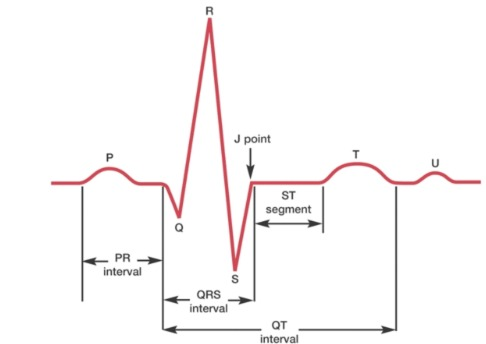
    
Figura 1. Representación de la actividad eléctrica del corazón en una señal de ECG.

En la Figura 1, se observa que el pico más elevado corresponde a la onda R, un componente esencial de la señal ECG que representa la despolarización de los ventrículos cardíacos. La detección precisa de los picos de la onda R es crucial para el diagnóstico de diversas condiciones cardíacas y para obtener una interpretación precisa de la señal ECG [2]. Para identificar estos picos, se utilizarán métodos de procesamiento de señales abordados en el laboratorio 7. Además, se emplearán los datos del ECG obtenidos en el laboratorio 4, específicamente de la segunda derivación, en condiciones de estado basal o respiración normal y después de realizar ejercicio.
 
El cálculo del HRV (variabilidad de la frecuencia cardíaca) es una herramienta importante para evaluar la actividad del sistema nervioso autónomo y el estado de salud cardiovascular. La HRV mide las variaciones en el intervalo de tiempo entre latidos consecutivos del corazón (intervalo RR), proporcionando información sobre la regulación del ritmo cardíaco [3].

## Metodología
Primero, se procedió a extraer la señal EKG en dos estados distintos: en estado basal y después del ejercicio. Posteriormente, se llevó a cabo una etapa de preprocesamiento que incluyó la aplicación de un filtro pasabanda Butterworth de orden 4, con frecuencias de corte de 0.5 a 35 Hz, así como un filtro Notch de 50 Hz, tal como se realizó en uno de los laboratorios anteriores titulado "Filtros IIR y FIR".

Una vez completada la etapa de preprocesamiento, se ingresó a la fase de procesamiento de las señales, donde el objetivo principal fue maximizar los picos QRS para facilitar su manipulación. Para lograr esto, nos basamos en un estudio realizado por investigadores de la Universidad de Malasia Perlis, quienes implementaron un protocolo de inducción de estrés basado en el test de Stroop para detectar el estrés utilizando señales de electrocardiograma (ECG) y variabilidad de la frecuencia cardíaca (HRV).

En el procesamiento de la señal ECG, se aplicó un filtro derivativo para reducir los efectos de la línea base errante y otros ruidos. Luego, se utilizó el algoritmo de descomposición en wavelet (DWT) con la función wavelet "coif5" y 8 niveles de descomposición, enfocándose en los coeficientes detallados d4, d5 y d6, junto con el coeficiente de aproximación a4, ya que corresponden a las frecuencias relacionadas con el complejo QRS. Después de la descomposición en wavelet y la extracción de los picos del complejo QRS, se aplicó un filtro cuadrático para refinar la señal, lo cual consistió en elevar al cuadrado la amplitud de los picos R para enfatizar los picos verdaderos y reducir los residuos ruidosos. [4]

Para la detección de picos, se utilizaron marcadores mediante la función findpeaks en Python, estableciendo dos umbrales: uno para los picos R y otro para la distancia mínima entre cada pico R. Finalmente, se generó el gráfico de la señal HRV y se calculó el valor RMSSD utilizando la fórmula presentada en el artículo mencionado. [4]

Es importante destacar que, a pesar de contar con la opción de utilizar el filtro derivativo propuesto en el ejemplo del curso de Python, se optó por buscar otro filtro derivativo proveniente de un estudio distinto para diversificar el enfoque. Se encontró un estudio realizado por investigadores de la Universidad de Nueva Gales del Sur (UNSW), quienes desarrollaron el algoritmo UNSW para detectar complejos QRS en señales de ECG. Se detalla el filtro derivativo utilizado en el código de procesamiento. [5]

Adjuntamos el siguiente diagrama de bloques del procedimiento con el cual se procesó la señal de principio a fin

    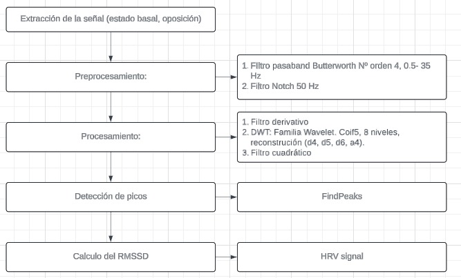
    
Figura 2. Diagrama del proceso de análisis de señales ECG.

## Resultados

### Códigos
- [Descanso - Basal](../../Software/Lab9/ecg_estado_basal.ipynb)
- [Después del Ejercicio](../../Software/Lab9/ecg_estado_ejercicio.ipynb)

### Preprocesamiento

#### Filtrado

**BASAL**
- Se realizó el filtrado de la señal ECG en estado basal para eliminar el ruido y las interferencias.

    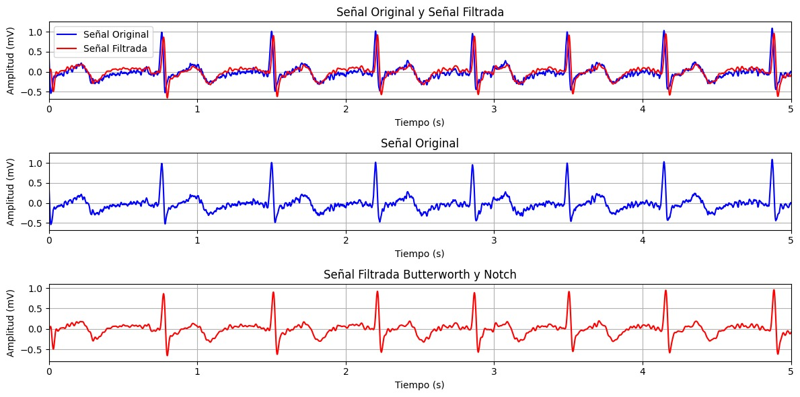
    
Figura 3. Filtrado de la señal ECG en estado basal.

**EJERCICIO**
- Se aplicó el mismo proceso de filtrado a la señal ECG obtenida después del ejercicio.

    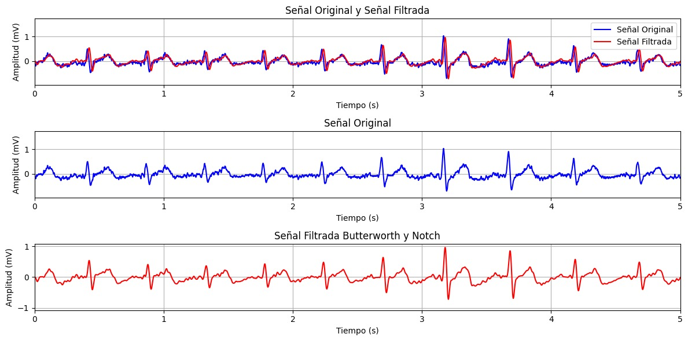
    
Figura 4. Filtrado de la señal ECG después del ejercicio.

#### Gráficas de Bode (filtros)

**BASAL**
- La gráfica de Bode para la señal ECG en estado basal muestra la respuesta en frecuencia del filtro utilizado.

    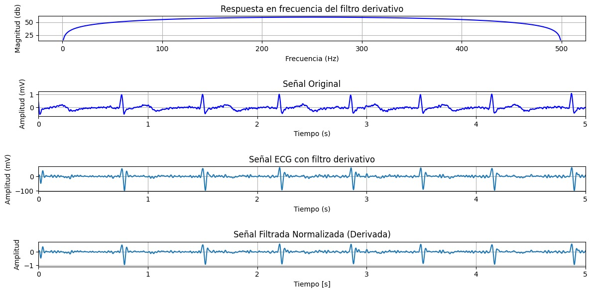
    
Figura 5. Respuesta en frecuencia del filtro aplicado a la señal ECG en estado basal.

**EJERCICIO**
- La gráfica de Bode para la señal ECG después del ejercicio proporciona una comparación de la efectividad del filtro en diferentes condiciones.

    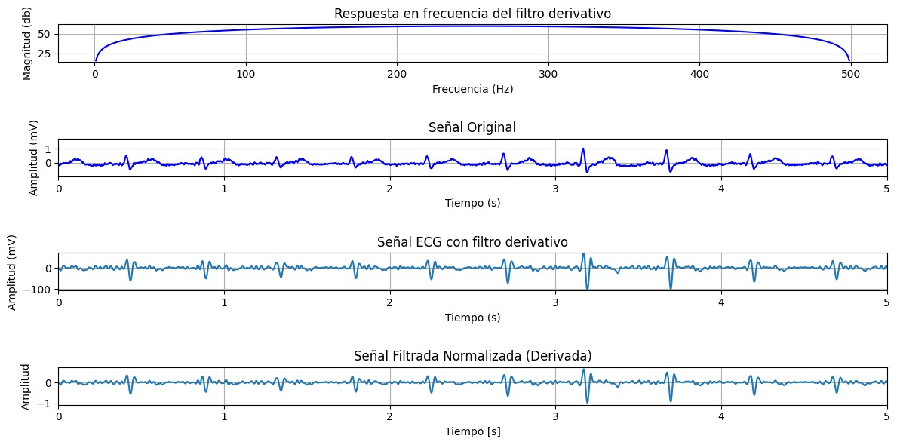
    
Figura 6. Respuesta en frecuencia del filtro aplicado a la señal ECG después del ejercicio.

### Extracción de características

#### Picos de onda R

**BASAL**
- Se identificaron y anotaron los picos de onda R en la señal ECG en estado basal.

    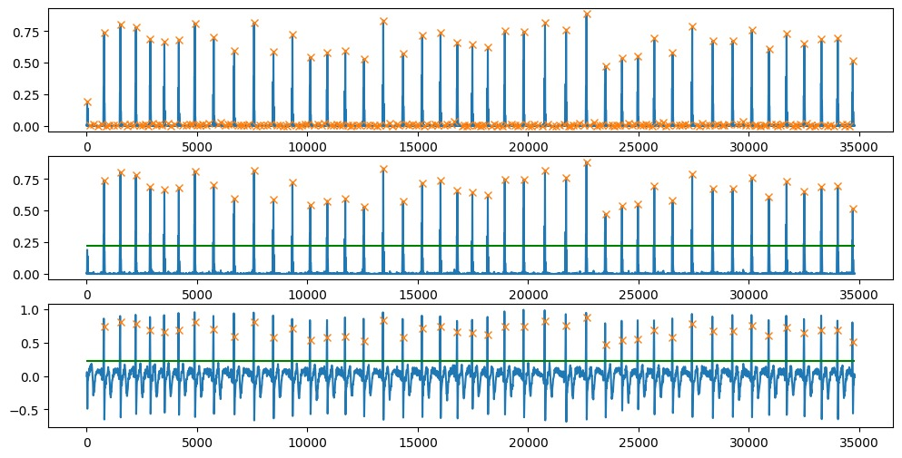
    
Figura 7. Identificación de picos de onda R en la señal ECG en estado basal.

**EJERCICIO**
- Los picos de onda R también fueron detectados en la señal ECG después del ejercicio.

    
    
Figura 8. Identificación de picos de onda R en la señal ECG después del ejercicio.

#### Gráfica HRV (basarse en un artículo base)

Eje Y (BPM) (60-90 BPM)

- [Artículo base](https://www.researchgate.net/profile/Prof-Murugappan/publication/263794817_Detection_of_human_stress_using-short-term_ECG_and_HRV_signals/links/0c96053c10b2a13dd3000000/Detection-of-human-stress-using-short-term-ECG-and-HRV-signals.pdf)
- [Video explicativo](https://youtu.be/3x4xbqYfYJ0?si=R3Eh0ECJ1f9z_d23)

**BASAL**
- La gráfica HRV de la señal en estado basal muestra la variación de la frecuencia cardiaca en condiciones normales.

    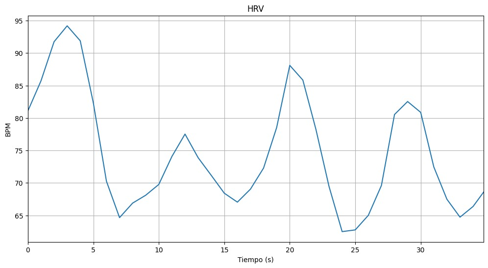
    
Figura 9. Gráfica HRV de la señal ECG en estado basal.

**EJERCICIO**
- La gráfica HRV después del ejercicio refleja los cambios en la frecuencia cardiaca debido a la actividad física.

    
    
Figura 10. Gráfica HRV de la señal ECG después del ejercicio.

#### Procesamiento y cálculo de RMSSD (paper y video)

- [Artículo base](https://www.researchgate.net/profile/Prof-Murugappan/publication/263794817_Detection_of_human_stress_using-short-term_ECG_and_HRV_signals/links/0c96053c10b2a13dd3000000/Detection-of-human-stress-using-short-term-ECG-and-HRV-signals.pdf)

**Filtro Cuadrático**

**BASAL**
- Aplicación del filtro cuadrático a la señal ECG en estado basal.

    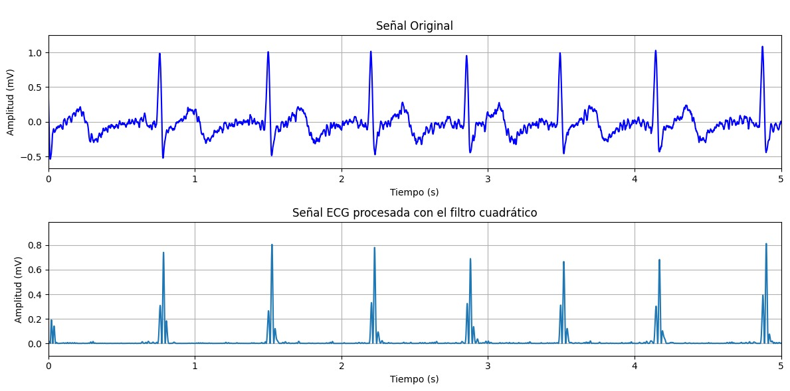
    
Figura 11. Aplicación del filtro cuadrático a la señal ECG en estado basal.

**EJERCICIO**
- Aplicación del filtro cuadrático a la señal ECG después del ejercicio.

    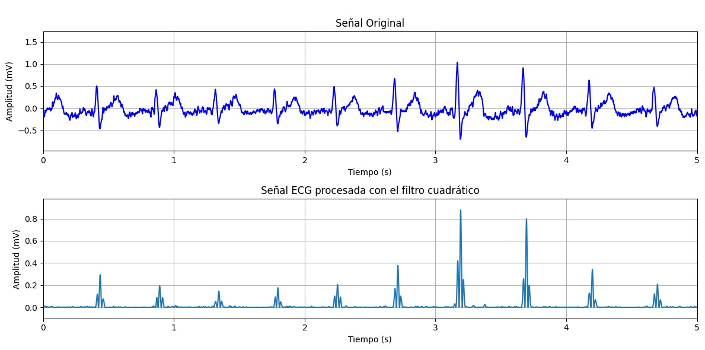
    
Figura 12. Aplicación del filtro cuadrático a la señal ECG después del ejercicio.

**Wavelet Coeficientes**

**BASAL**
- Extracción de coeficientes wavelet de la señal ECG en estado basal.

    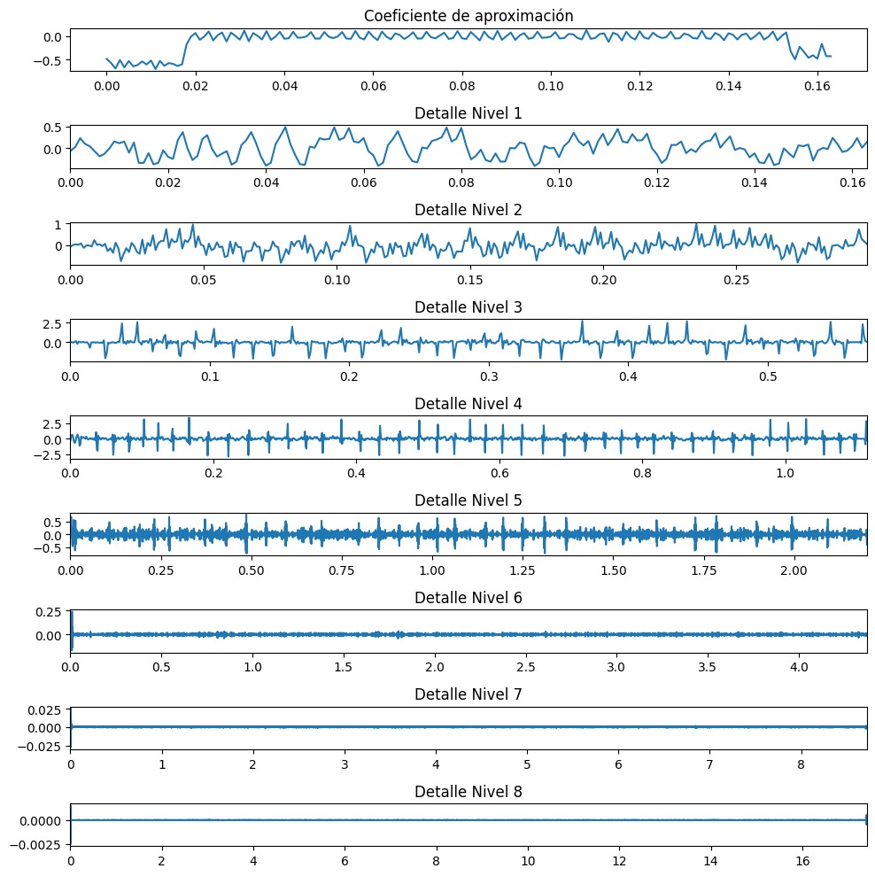
        
Figura 13. Extracción de coeficientes Wavelet Estado Basal

**EJERCICIO**
- Extracción de coeficientes wavelet de la señal ECG después del ejercicio.

    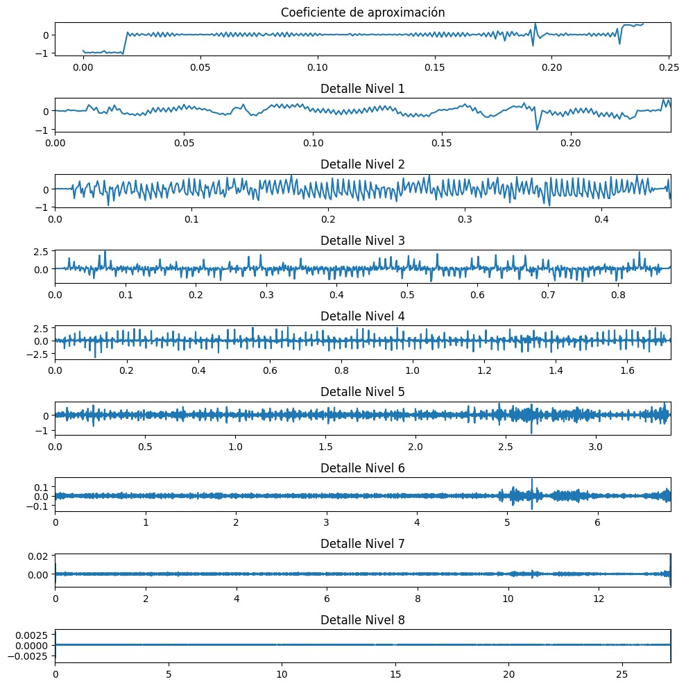
        
Figura 14. Extracción de coeficientes Wavelet en Ejercicio

**Wavelet Filtro**

**BASAL**
- Aplicación de un filtro wavelet a la señal ECG en estado basal.

    
        
Figura 15. Filtro Wavelet a la señal filtrada en Estado Basal.

**EJERCICIO**
- Aplicación de un filtro wavelet a la señal ECG después del Ejercicio.

    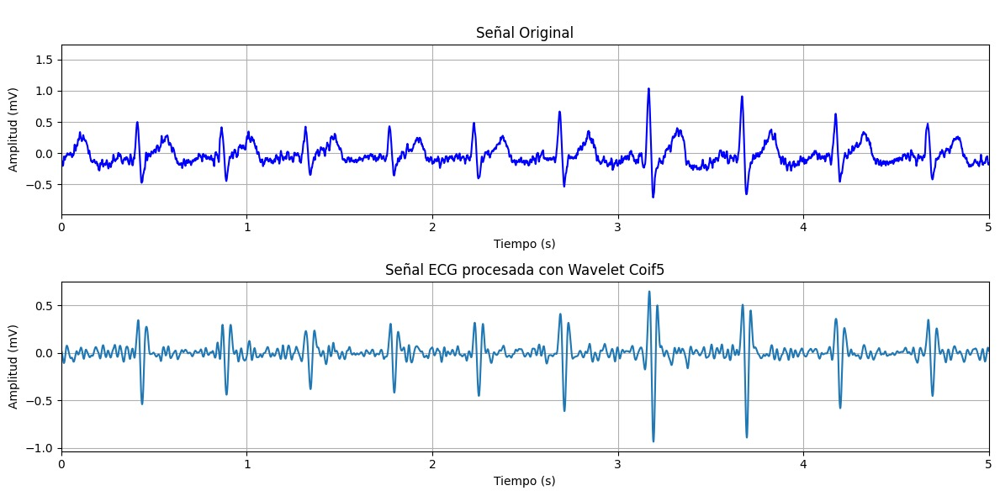
        
Figura 16. Filtro Wavelet a la señal filtrada en ejercicio.

### Estado Basal

- El valor del umbral de pico R de entrada es 0.22129912038766478
- El valor de la distancia entre picos R es 300.0
- El valor del RMSSD es 55.39415307703454

### En Ejercicio

- El valor del umbral de pico R de entrada es 0.21929202226518196
- El valor de la distancia entre picos R es 300.0
- El valor del RMSSD es 556.9206894352083

## REUSLTADOS Y DISCUSIÓN
Se compararon dos estados fisiológicos distintos: el estado basal y el estado después del ejercicio, utilizando señales de electrocardiograma (EKG). Los resultados obtenidos revelan cambios significativos en varios parámetros, tanto en las señales EKG como en la variabilidad de la frecuencia cardíaca (HRV), que reflejan las adaptaciones del sistema cardiovascular ante diferentes niveles de actividad física.

La validez de las señales HRV a corto plazo es uno de los principales obstáculos. Para la estandarización de HRV en datos ECG a corto plazo se recomienda como mínimo 5 minutos. Debido a que las medidas a corto plazo de la HRV regresan rápidamente al valor inicial después de perturbaciones transitorias inducidas por el ejercicio suave, cuando se realiza un monitoreo ambulatorio de 24 horas se encuentra mayor estabilidad en las medidas de HRV.  [3]

Asimismo, la raíz cuadrada de la media de la suma de los cuadrados de las diferencias entre intervalos normales a normales adyacentes (RMSSD) es más sensible a los artefactos que los parámetros del dominio de la frecuencia, un solo artefacto puede inducir a una interpretación errónea del HRV. Por lo que, una buena corrección de artefactos combinando análisis en el dominio del tiempo y frecuencia debería hacer más confiable y consistente la interpretación de HRV. [6] 

Al analizar las señales EKG en estado basal y después del ejercicio, se observan diferencias en los valores de umbral de pico R y en la distancia entre picos R. En el estado basal, el valor del umbral de pico R es de 0.221, mientras que en el estado de ejercicio es ligeramente menor, con un valor de 0.219. 

### Variabilidad de la Frecuencia Cardíaca (HRV):

En las gráficas de HRV, se observa una diferencia notable en el valor del RMSSD entre el estado basal y el estado de ejercicio. En estado basal, el valor del RMSSD es de 55.39, mientras que después del ejercicio aumenta significativamente a 33.09. Este incremento en el RMSSD durante el ejercicio indica una mayor variabilidad en la frecuencia cardíaca

La señal HRV es el tiempo que transcurre entre dos picos RR. En las gráficas de HRV, se observa que en estado basal se tiene entre 65 a 95 latidos por minuto a diferencia de luego del ejercicio en dónde supera los 120 latidos por minuto (100 - 130 BPM). Esto se puede evidenciar con la respuesta fisiológica esperada durante el ejercicio, donde el sistema cardiovascular responde aumentando la frecuencia cardíaca para satisfacer las demandas metabólicas del cuerpo. Se sabe que mientras más grande es el HRV, mayor es la recuperación y menor el estrés del organismo. En este caso, el sujeto de prueba es un deportista calificado de vóleibol que entrena todos los días por lo que su resistencia permite una recuperación rápida con 120 BPM. Cabe resaltar, que un entrenamiento continuo aumenta el HRV. 

### Sobre el método realizado:

Cabe resaltar que el método que utilizamos nos da resultados aproximados de la ubicación de los picos R, más no la ubicación exacta de los picos R en la señal verdadera, además que es necesario modificar el umbral y realizar una inspecciòn visual de los marcadores para asegurarnos de abarcar los picos R correctos y la gran mayoría de ellos.

Nos ayudó a comprender sobre:

- Comparar los valores de RMSSD en estado basal y después del ejercicio para entender los efectos de la actividad física en la variabilidad de la frecuencia cardiaca.
- Evaluar la efectividad de los diferentes filtros aplicados a las señales ECG.
- Analizar la precisión de la detección de picos R y la extracción de características usando técnicas wavelet.

## Referencias
[1] Ashley, E. A., and J. Niebauer, Cardiology Explained. London: Remedica, 2004, ch. 3, Conquering the ECG. [Online]. Available: https://www.ncbi.nlm.nih.gov/books/NBK2214/.

[2] J. Pan and W. J. Tompkins, "A Real-Time QRS Detection Algorithm," IEEE Transactions on Biomedical Engineering, vol. BME-32, no. 3, pp. 230-236, March 1985, doi: 10.1109/TBME.1985.325532.

[3] Task Force of the European Society of Cardiology and the North American Society of Pacing and Electrophysiology, "Heart rate variability: Standards of measurement, physiological interpretation, and clinical use," Circulation, vol. 93, no. 5, pp. 1043-1065, March 1996.

[4] K. Palanisamy, M. Murugappan, and S. Yaacob, "Detection of human stress using short-term ECG and HRV signals," Journal of Mechanics in Medicine and Biology, vol. 12, no. 3, pp. 1350038-1-1350038-15, Apr. 2013. DOI: 10.1142/S0219519413500383.

[5] Khamis H, Weiss R, Xie Y, Chang C-W, Lovell NH, Redmond SJ. QRS detection algorithm for telehealth electrocardiogram recordings. IEEE Trans Biomed Eng [Internet]. 2016 [cited 2024 Jun 8];63(7):1377–88. Available from: https://pubmed.ncbi.nlm.nih.gov/27046889/

[6] N. Bourdillon et al, "RMSSD Is More Sensitive to Artifacts Than Frequency-Domain Parameters: Implication in Athletes’ Monitoring," Jsportscimed, pp. 260, 2022. . DOI: 10.52082/jssm.2022.260.

### LINKS

- [Biosignals Notebooks](https://github.com/pluxbiosignals/biosignalsnotebooks)

Para la detección de eventos como picos:
- [Detección de picos R](http://notebooks.pluxbiosignals.com/notebooks/Categories/Detect/r_peaks_rev.html)

Para el análisis de parámetros de variabilidad de la frecuencia cardiaca:
- [Análisis de parámetros HRV](http://notebooks.pluxbiosignals.com/notebooks/Categories/Extract/hrv_parameters_rev.html)

- [A Real-Time QRS Detection Algorithm](https://ieeexplore.ieee.org/document/4122029)
