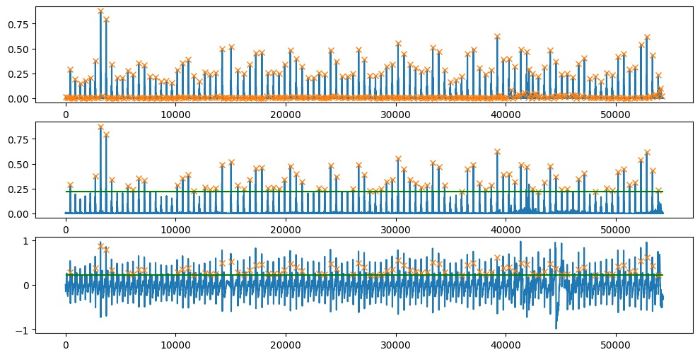

# LAB 11 - PROCESAMIENTO ECG

## TABLA DE CONTENIDOS
- [Objetivos](#objetivos)
- [Materiales](#materiales)
- [Introducción](#introducción)
- [Metodología](#metodología)
- [Resultados](#resultados)
  - [Códigos](#códigos)
  - [Preprocesamiento](#preprocesamiento)
    - [Filtrado](#filtrado)
    - [Gráficas de Bode (filtros)](#gráficas-de-bode-filtros)
  - [Extracción de características](#extracción-de-características)
    - [Picos de onda R](#picos-de-onda-r)
    - [Gráfica HRV (basarse en un artículo base)](#gráfica-hrv-basarse-en-un-artículo-base)
      - [Eje Y (BPM) (60-90 BPM)](#eje-y-bpm-60-90-bpm)
      - [Artículo base](#artículo-base)
      - [Video explicativo](#video-explicativo)
    - [Procesamiento y cálculo de RMSSD (paper y video)](#procesamiento-y-cálculo-de-rmssd-paper-y-video)
      - [Filtro Cuadrático](#filtro-cuadrático)
      - [Wavelet Coeficientes](#wavelet-coeficientes)
      - [Wavelet Filtro](#wavelet-filtro)
      - [Estado Basal](#estado-basal)
      - [En Ejercicio](#en-ejercicio)
- [Discusión de resultados](#discusión-de-resultados)
- [Referencias](#referencias)
  - [Biosignals Notebooks](#biosignals-notebooks)
  - [Links](#links)

## Objetivos
- Analizar los datos del ECG de la 2da derivación.
- Comparar las señales de ECG en estado basal y después de ejercicio.
- Realizar el preprocesamiento y extracción de características de las señales de ECG.
- Calcular el RMSSD y analizar los resultados obtenidos.

## Materiales
- Datos de ECG del laboratorio 4.
- Herramientas de análisis de señales (software de filtrado, herramientas de cálculo de HRV, etc.).

## Introducción
La señal de ECG produce una gráfica que representa la actividad eléctrica del corazón. Esta gráfica sigue un patrón básico, determinado por el tipo de actividad cardíaca: la actividad eléctrica dirigida hacia un electrodo provoca una deflexión ascendente, mientras que la actividad eléctrica alejada de un electrodo causa una deflexión descendente. Las deflexiones de despolarización y repolarización ocurren en direcciones opuestas. Este patrón eléctrico básico comprende tres ondas: P, QRS (un complejo de ondas), y T (ver Figura 1) [1].

    
    
Figura 1. Representación de la actividad eléctrica del corazón en una señal de ECG.

En la Figura 1, se observa que el pico más elevado corresponde a la onda R, un componente esencial de la señal ECG que representa la despolarización de los ventrículos cardíacos. La detección precisa de los picos de la onda R es crucial para el diagnóstico de diversas condiciones cardíacas y para obtener una interpretación precisa de la señal ECG [2]. Para identificar estos picos, se utilizarán métodos de procesamiento de señales abordados en el laboratorio 7. Además, se emplearán los datos del ECG obtenidos en el laboratorio 4, específicamente de la segunda derivación, en condiciones de estado basal o respiración normal y después de realizar ejercicio.
 
El cálculo del HRV (variabilidad de la frecuencia cardíaca) es una herramienta importante para evaluar la actividad del sistema nervioso autónomo y el estado de salud cardiovascular. La HRV mide las variaciones en el intervalo de tiempo entre latidos consecutivos del corazón (intervalo RR), proporcionando información sobre la regulación del ritmo cardíaco [3].

## Metodología
Para el procesamiento de las señales ECG, se realizará un preprocesamiento inicial que incluye filtrado y generación de gráficas de Bode. Posteriormente, se extraerán las características relevantes como los picos de onda R y se generarán gráficas de HRV. Finalmente, se calculará el RMSSD y se discutirán los resultados.

Para ese proceso se hizo el siguiente diagrama.

    
    
Figura 2. Diagrama del proceso de análisis de señales ECG.

## Resultados

### Códigos
- [Descanso - Basal](../../Software/Lab9/ecg_estado_basal.ipynb)
- [Después del Ejercicio](../../Software/Lab9/ecg_estado_despues_ejercicio.ipynb)

### Preprocesamiento

#### Filtrado

**BASAL**
- Se realizó el filtrado de la señal ECG en estado basal para eliminar el ruido y las interferencias.

    
    
Figura 3. Filtrado de la señal ECG en estado basal.

**EJERCICIO**
- Se aplicó el mismo proceso de filtrado a la señal ECG obtenida después del ejercicio.

    
    
Figura 4. Filtrado de la señal ECG después del ejercicio.

#### Gráficas de Bode (filtros)

**BASAL**
- La gráfica de Bode para la señal ECG en estado basal muestra la respuesta en frecuencia del filtro utilizado.

    
    
Figura 5. Respuesta en frecuencia del filtro aplicado a la señal ECG en estado basal.

**EJERCICIO**
- La gráfica de Bode para la señal ECG después del ejercicio proporciona una comparación de la efectividad del filtro en diferentes condiciones.

    
    
Figura 6. Respuesta en frecuencia del filtro aplicado a la señal ECG después del ejercicio.

### Extracción de características

#### Picos de onda R

**BASAL**
- Se identificaron y anotaron los picos de onda R en la señal ECG en estado basal.

    
    
Figura 7. Identificación de picos de onda R en la señal ECG en estado basal.

**EJERCICIO**
- Los picos de onda R también fueron detectados en la señal ECG después del ejercicio.

    
    
Figura 8. Identificación de picos de onda R en la señal ECG después del ejercicio.

#### Gráfica HRV (basarse en un artículo base)

Eje Y (BPM) (60-90 BPM)

- [Artículo base](https://www.researchgate.net/profile/Prof-Murugappan/publication/263794817_Detection_of_human_stress_using-short-term_ECG_and_HRV_signals/links/0c96053c10b2a13dd3000000/Detection-of-human-stress-using-short-term-ECG-and-HRV-signals.pdf)
- [Video explicativo](https://youtu.be/3x4xbqYfYJ0?si=R3Eh0ECJ1f9z_d23)

**BASAL**
- La gráfica HRV de la señal en estado basal muestra la variación de la frecuencia cardiaca en condiciones normales.

    
    
Figura 9. Gráfica HRV de la señal ECG en estado basal.

**EJERCICIO**
- La gráfica HRV después del ejercicio refleja los cambios en la frecuencia cardiaca debido a la actividad física.

    
    
Figura 10. Gráfica HRV de la señal ECG después del ejercicio.

#### Procesamiento y cálculo de RMSSD (paper y video)

- [Artículo base](https://www.researchgate.net/profile/Prof-Murugappan/publication/263794817_Detection_of_human_stress_using-short-term_ECG_and_HRV_signals/links/0c96053c10b2a13dd3000000/Detection-of-human-stress-using-short-term-ECG-and-HRV-signals.pdf)

**Filtro Cuadrático**

**BASAL**
- Aplicación del filtro cuadrático a la señal ECG en estado basal.

    
    
Figura 11. Aplicación del filtro cuadrático a la señal ECG en estado basal.

**EJERCICIO**
- Aplicación del filtro cuadrático a la señal ECG después del ejercicio.

    
    
Figura 12. Aplicación del filtro cuadrático a la señal ECG después del ejercicio.

**Wavelet Coeficientes**

**BASAL**
- Extracción de coeficientes wavelet de la señal ECG en estado basal.

    
        
Figura 13. Extracción de coeficientes Wavelet Estado Basal

**EJERCICIO**
- Extracción de coeficientes wavelet de la señal ECG después del ejercicio.

    
        
Figura 14. Extracción de coeficientes Wavelet en Ejercicio

**Wavelet Filtro**

**BASAL**
- Aplicación de un filtro wavelet a la señal ECG en estado basal.

    
        
Figura 15. Filtro Wavelet a la señal filtrada en Estado Basal.

**EJERCICIO**
- Aplicación de un filtro wavelet a la señal ECG después del Ejercicio.

    
        
Figura 16. Filtro Wavelet a la señal filtrada en ejercicio.

### Estado Basal

- El valor del umbral de pico R de entrada es 0.22129912038766478
- El valor de la distancia entre picos R es 300.0
- El valor del RMSSD es 55.39415307703454

### En Ejercicio

- El valor del umbral de pico R de entrada es 0.21929202226518196
- El valor de la distancia entre picos R es 300.0
- El valor del RMSSD es 556.9206894352083

## Discusión de resultados
- Comparar los valores de RMSSD en estado basal y después del ejercicio para entender los efectos de la actividad física en la variabilidad de la frecuencia cardiaca.
- Evaluar la efectividad de los diferentes filtros aplicados a las señales ECG.
- Analizar la precisión de la detección de picos R y la extracción de características usando técnicas wavelet.

## Referencias
[1] Ashley, E. A., and J. Niebauer, Cardiology Explained. London: Remedica, 2004, ch. 3, Conquering the ECG. [Online]. Available: https://www.ncbi.nlm.nih.gov/books/NBK2214/.

[2] J. Pan and W. J. Tompkins, "A Real-Time QRS Detection Algorithm," IEEE Transactions on Biomedical Engineering, vol. BME-32, no. 3, pp. 230-236, March 1985, doi: 10.1109/TBME.1985.325532.

[3] Task Force of the European Society of Cardiology and the North American Society of Pacing and Electrophysiology, "Heart rate variability: Standards of measurement, physiological interpretation, and clinical use," Circulation, vol. 93, no. 5, pp. 1043-1065, March 1996.

[4] J. Pan and W. J. Tompkins, "A Real-Time QRS Detection Algorithm," in IEEE Transactions on Biomedical Engineering, vol. BME-32, no. 3, pp. 230-236, March 1985, doi: 10.1109/TBME.1985.325532.
keywords: {Detection algorithms;Electrocardiography;Detectors;Databases;Band pass filters;Interference;Filtering;Computer displays;Digital filters;Noise reduction},

### LINKS

- [Biosignals Notebooks](https://github.com/pluxbiosignals/biosignalsnotebooks)

Para la detección de eventos como picos:
- [Detección de picos R](http://notebooks.pluxbiosignals.com/notebooks/Categories/Detect/r_peaks_rev.html)

Para el análisis de parámetros de variabilidad de la frecuencia cardiaca:
- [Análisis de parámetros HRV](http://notebooks.pluxbiosignals.com/notebooks/Categories/Extract/hrv_parameters_rev.html)

- [A Real-Time QRS Detection Algorithm](https://ieeexplore.ieee.org/document/4122029)
