# LABORATORIO N° 2 – ADQUISICIÓN DE SEÑALES Y GRAFICACIÓN EN ARDUINO
## Tabla de contenidos:

1. [Objetivos específicos de la práctica](#1-objetivos-específicos-de-la-práctica)
2. [Materiales y equipo](#2-materiales-y-equipo)
3. [Procedimiento](#3-procedimiento)
4. [Entregable](#4-entregable)

## 1. Objetivos específicos de la práctica

* Adquirir señales conocidas como señal cuadrada, triangular, senoidal, rampa, etc.
* Entender los criterios de selección de la frecuencia de muestreo. 
* Manipular y configurar adecuadamente una fuente de alimentación regulable; multímetro digital;  Generador de señales y osciloscopio digital. 

## 2. Materiales y equipo
| Equipo                               | Materiales                         |
|--------------------------------------|------------------------------------|
| **Cantidad**                         | **Modelo**                         | **Descripción**                                      |
| 1                                    | AFG1022                            | Generador de Señales                                |
| 1                                    | TBS 1000C Series                   | Osciloscopio Digital                                |
| -                                    | Cable BNC Male-Male                |                                                     |
| -                                    | Punta de osciloscopio con conector BNC (Male) |                                                     |
| -                                    | Par de cables Male-Male            |                                                     |
| 1                                    | SAMD                               | Arduino 33 IoT                                      |

## 3. Procedimiento
1. Encender el Generador de Señales y el Osciloscopio.
2. Configurar el Generador de Señales para proporcionar una señal sinusoidal de 1 KHz de frecuencia, 1.5V de Amplitud y 0V de offset, por el canal 1.
3. Conectar un extremo del cable BNC en el canal 1 del generador de señales y el otro extremo en el canal 1 del osciloscopio.

  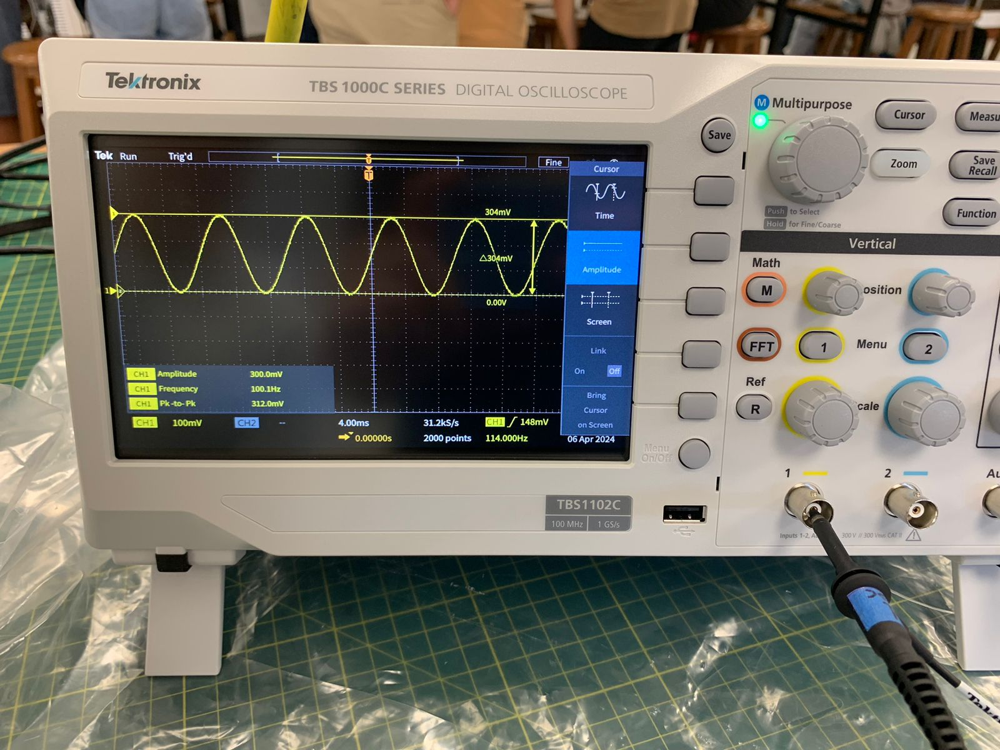
  
Fig 1. Conexión del canal del generador de señales

4. Mediante los controles de Posición Vertical, Horizontal y Disparo ajustar la visualización de la señal sinusoidal.

  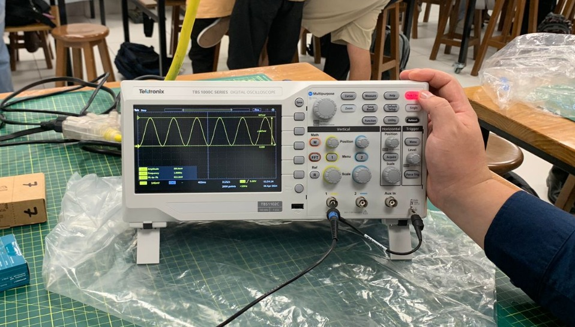
  
Fig 2. Ajustar la visualización

5. Haciendo uso de los cursores, calcular y mostrar en el osciloscopio las medidas de Amplitud y Periodo de la señal.

  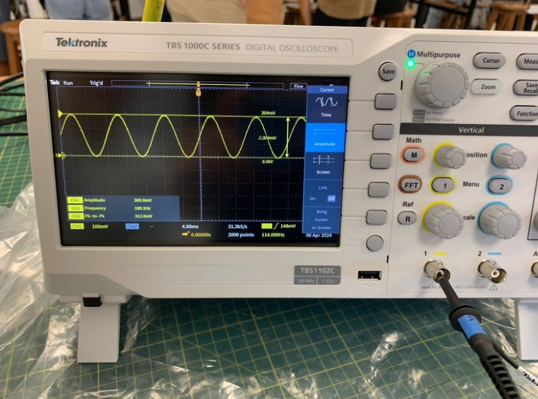
  
Fig 3. Mostrar medidas

6. Al realizar la verificación de la señal que sale por la sonda del generador de señal, se observa que a pesar de configurar un voltaje de salida de 1.5V con 0V de offset, la señal es atenuada por la sonda de osciloscopio.

7. **Conexión generador de señales y Arduino nano 33 IoT**

  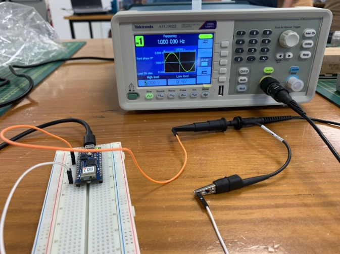
  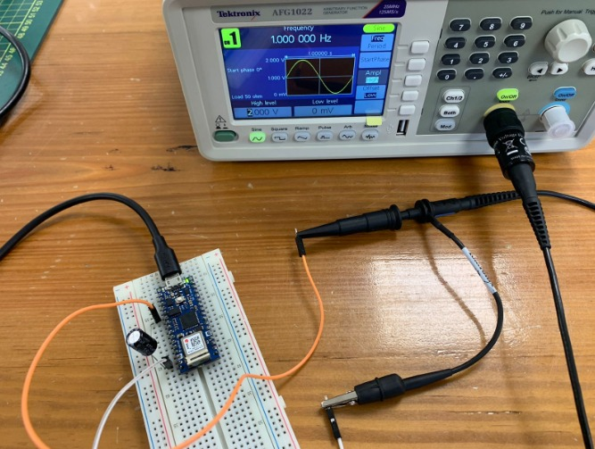
  
Fig 4. Conexión del Arduino sin condensador & Fig 5. Conexión del Arduino con condensador

La conexión inicialmente se realizó utilizando dos jumpers, sin embargo, en las gráficas ploteadas se observaba bastante ruido que impedía distinguir las señales.

  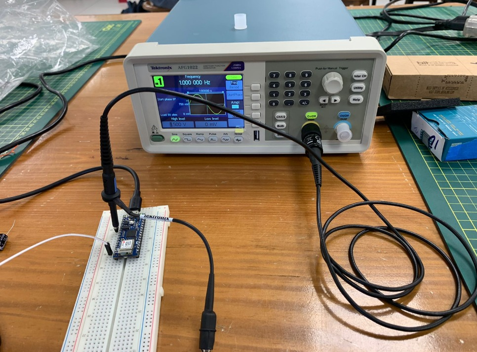
  
Fig 6. Conexión final

Tras realizar varias pruebas, se observó que de esta manera se mejoraba la conexión del Arduino Nano 33 IoT con el generador de señales.

8. **Ploteo de señales**

  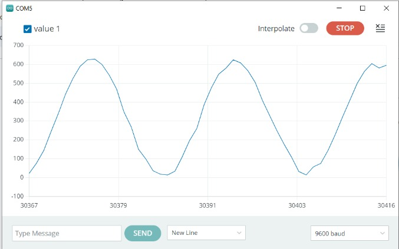
  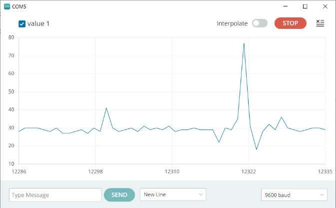
  
Fig 7. Plot de la señal sin condensador & Fig 8. Plot de la señal con condensador

Con las conexiones hechas se obtuvo el ploteo de las señales. Inicialmente, se realizó sin conectar el condensador y luego con el condensador. El condensador actúa formando un circuito RC con la resistencia interna del Arduino, el filtro es del tipo pasa altas.

## 4. Entregable
- ### Plotear al menos 3 señales en Arduino IDE provenientes del generador de señales.

  
Fig 9. Plot señal sinusoidal

  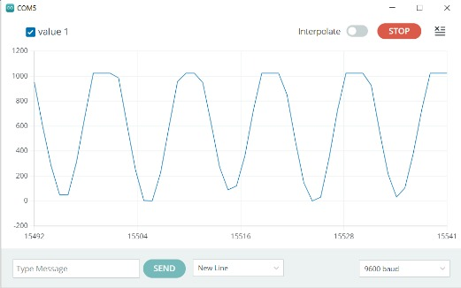

  
Fig 10. Señal cuadrática

  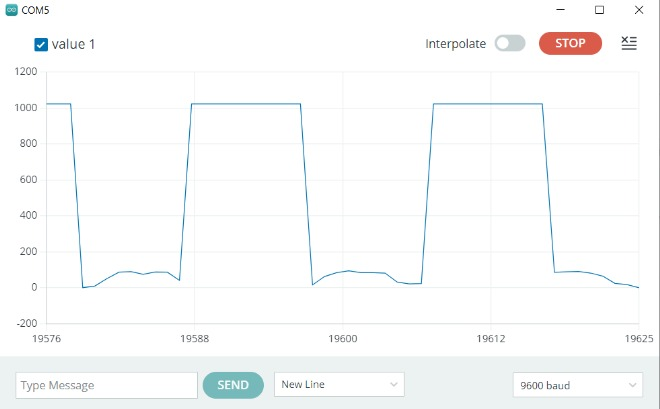

  
Fig 11. Plot señal triangular

  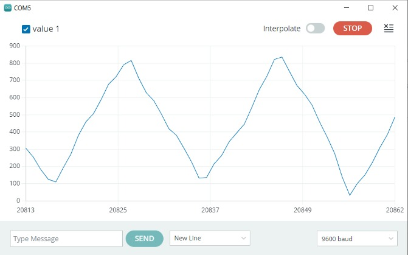

Se plotearon las 3 señales (Fig 9-11) provenientes del generador de señales en el Arduino IDE y se obtuvieron gráficas que representan el tipo de señal generada.

- ### Comparar las señales graficadas del Arduino IDE con las gráficas obtenidas del osciloscopio.

  
Fig 12. Señal sinusoidal del generador de señales

  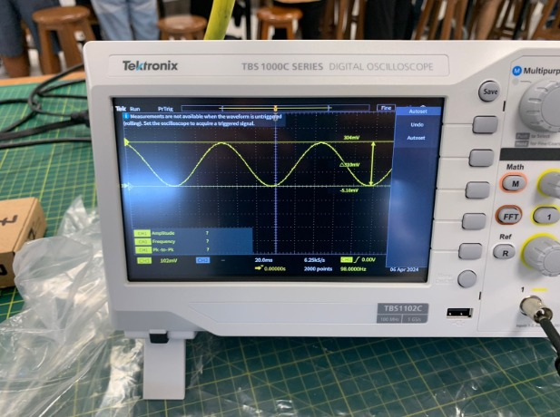

  
Fig 13. Señal cuadrática del generador de señales

  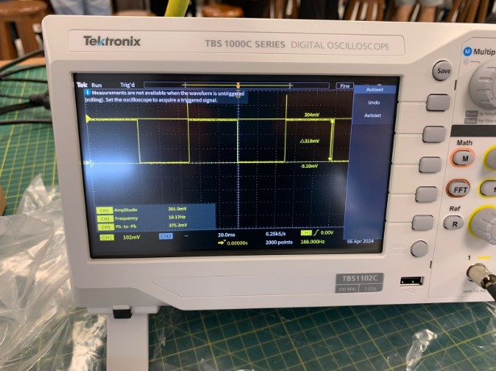

  
Fig 14. Señal triangular del generador de señales

  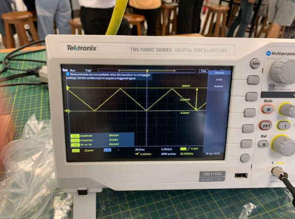

Las señales obtenidas ploteando en el Arduino IDE con las gráficas del osciloscopio, se observa que las señales en el Arduino IDE presentan un cierto ruido en las señales comparado a las señales vistas desde el osciloscopio. La diferencia entre estas señales se puede deber a que se utilizó un jumper para establecer la conexión. Durante la experiencia se utilizaron dos jumpers y el ruido disminuyó al conectar una punta de la sonda directamente al protoboard sin utilizar el jumper. Además, se pueden generar interferencias por la presencia de otros equipos electrónicos presentes en la mesa.

- ### Graficar en Arduino cloud.

   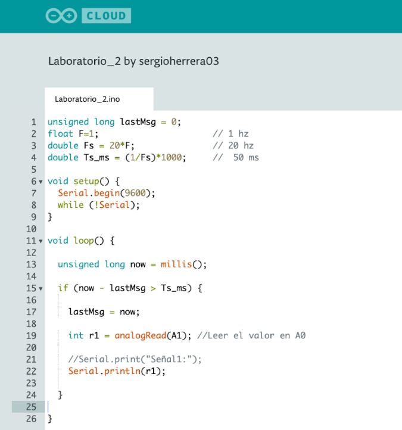
    
Fig 15. Código en Arduino cloud

  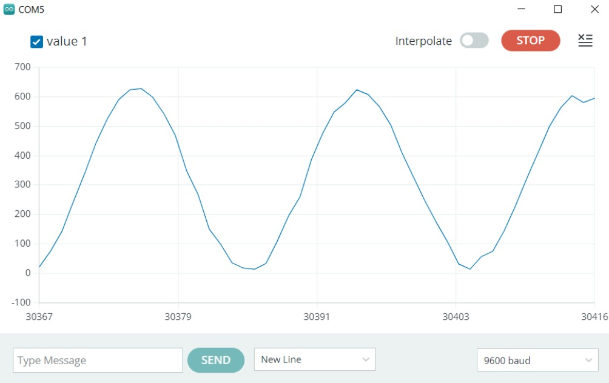
  
Fig 16. Gráfica sinusoidal de frecuencia 1 Hz, frecuencia de muestreo 20 Hz

  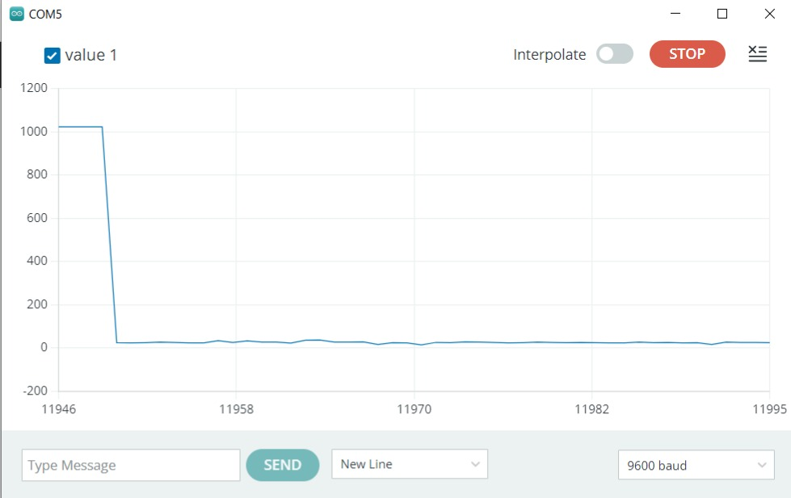
  
Fig 17. Gráfica cuadrática de frecuencia 1 Hz, frecuencia de muestreo 20 Hz y condensador (al inicio)

  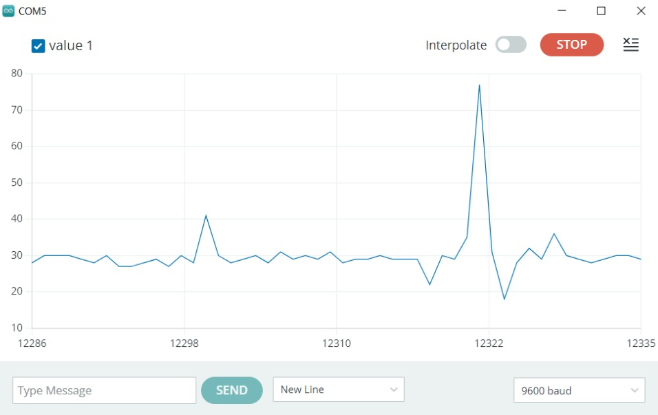
  
Fig 18. Gráfica cuadrática de frecuencia 1 Hz, frecuencia de muestreo 20 Hz y condensador (ya con tiempo)

   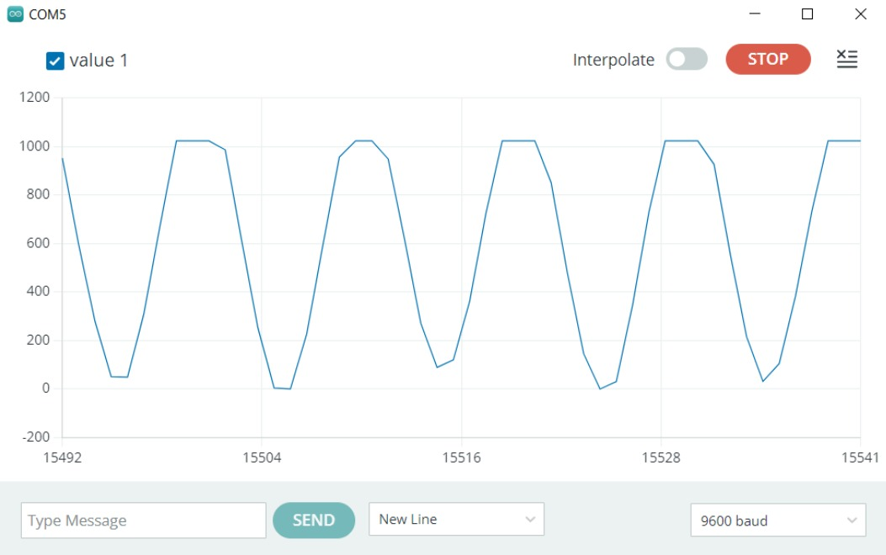
   
Fig 19. Gráfica sinusoidal de frecuencia 1 Hz, frecuencia de muestreo 10 Hz

  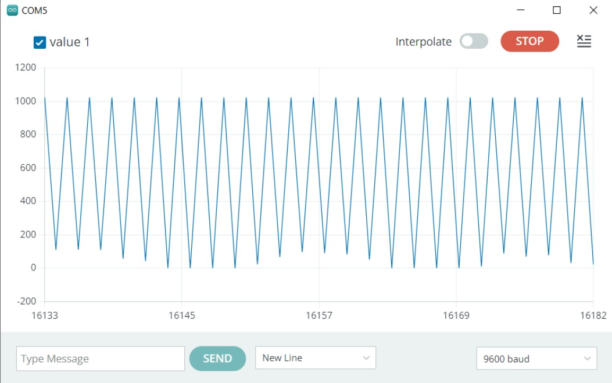
  
Fig 20. Gráfica sinusoidal de frecuencia 1 Hz, frecuencia de muestreo 2 Hz

  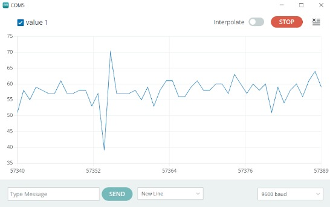
  
Fig 21. Gráfica sinusoidal de frecuencia 500 Hz, frecuencia de muestreo 20 Hz con capacitor

  

  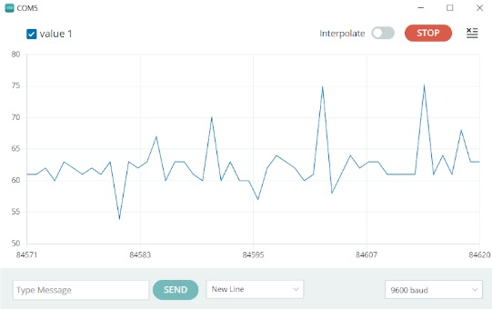
  
Fig 22. Gráfica sinusoidal de frecuencia 10 Hz, frecuencia de muestreo 20 Hz con capacitor

