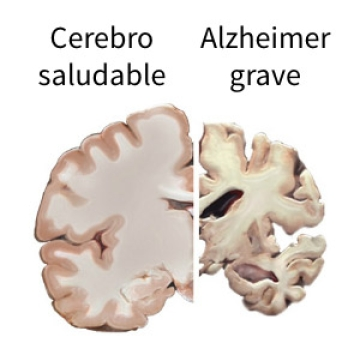
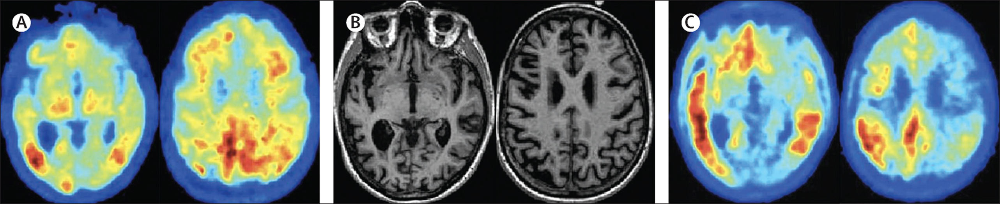
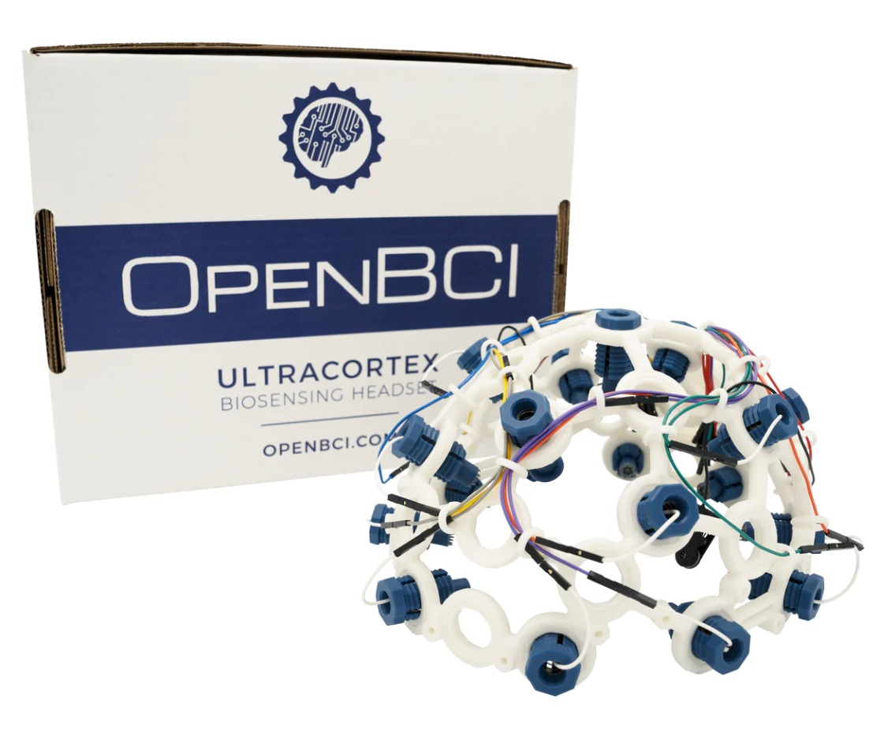
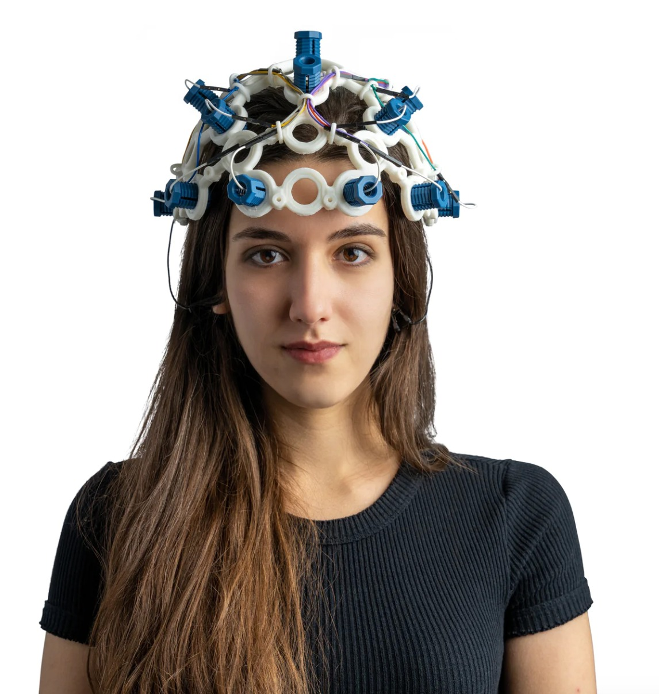

# Bienvenidos al repositorio del Grupo 9 en el curso “Introducción a Señales Biomédicas”
 Realizado por estudiantes de Ingeniería Biomédica de la Universidad Peruana Cayetano Heredia (UPCH) y la Pontificia Universidad Católica del Perú (PUCP), en el semestre 2024.1

Proyecto: Caracterización de la enfermedad del Alzheimer mediante EEG como potencial herramienta de diagnóstico temprano.

El objetivo de este proyecto es desarrollar una herramienta de deteción temprana con el uso del EEG para proporcionar una solución más accesible, económica y menos invasiva. Así, poder identificar patrones anómalos en la actividad eléctrica cerebral asociada con el Alzhéimer, lo que permitiría intervenciones más tempranas y potencialmente más efectivas para maximizar el nivel de vida de los pacientes.

#

## Tabla de contenidos:

* [Descripción del proyecto](#descripcion-del-proyecto)
* [Materiales necesarios](#materiales-necesarios)
* [Metodología de trabajo](#metodologia-de-trabajo)
* [Temática del proyecto](#tematica-del-proyecto)
* [Contenido del curso](#contenido-del-curso)
* [Participantes](#participantes)
* [Docentes](#docentes)
* [Jefes de práctica](#jefes-de-práctica)

## Descripción del proyecto

[Ver Presentación](https://www.canva.com/design/DAGBVwR0aRk/EpQsPL15Y5OwZCgcwBEfCA/view?utm_content=DAGBVwR0aRk&utm_campaign=designshare&utm_medium=link&utm_source=editor) 

1. ### Planteamiento del problema
    La enfermedad del Alzheimer (EA) es un trastorno neurodegenerativo progresivo y de los más comunes que existen  en personas mayores. Se estima un aumento en las personas que de 2030 con 75 millones, se presente un aproximado de 131 millones de personas. [1]
    

    
    
 Figure 1. Comparación de cerebros con y sin Alzheimer [2]

    Aunque hoy en día no existe una cura, el tratamiento es un punto clave para su progresión; por lo que el diagnóstico a temprana etapa es necesario para maximizar el nivel de vida de los pacientes [3].    La progresión patológica de la EA conduce a la desconexión cortical, que pueden manifestarse como alteraciones de la conectividad funcional [4]   
    #### ANOMALÍAS EN EL EEG EN PACIENTES CON EA:
    - Cambio del espectro de potencia a frecuencias más bajas
    - Disminución de la coherencia de los ritmos rápidos [4]
    - Desaceleración del EEG
    - Complejidad reducida
    - Disminución de la sincronía [5]
    - Disminución significativa del poder alfa relativo
    - Aumento del poder theta
    - Notable aumento en al complejidad Omega
    - Menor probabilidad de sincronización en la EA en los rangos de 0,5 a 25 Hz [6]
    - La interrelación en alfa posterios (8-12 Hz)  y delta generalizada (<4 Hz)  y thetha (4-8 Hz) [7]

    #### MÉTODOS DE DIAGNÓSTICO ACTUALES:
    Pruebas de diagnóstico:
    * Realizar pruebas de memoria, resolución de problemas, atención, conteo y lenguaje.
    * Ordenar pruebas médicas para identificar otras posibles causas.
    * Recolectar líquido cefalorraquídeo o sangre para medir los niveles de proteínas asociadas con el Alzheimer.
    * Realizar escaneos cerebrales (CT, MRI, PET) para apoyar el diagnóstico o descartar otras causas [3].
    

    
    
 Figure 2. Imágenes encontradas de pacientes con Alzheimer [3]

    ### PROBLEMÁTICA
    Actualmente, el diagnóstico de esta enfermedad suele basarse en síntomas clínicos y pruebas neuropsicológicas que pueden no ser lo suficientemente sensibles para detectar los cambios tempranos en el cerebro, además que las pruebas invasivas de extracción de líquido cefalorraquídeo (LCR) para el diagnóstico pueden generar ansiedad y riesgos para los pacientes. El diagnóstico por imágenes médicas, como la resonancia magnética (RM), la tomografía computarizada (TC) y la tomografía por emisión de positrones (PET) aunque son altamente efectivos para detectar cambios estructurales y funcionales en el cerebro, pueden ser considerablemente más costosos y menos accesibles que el electroencefalograma (EEG).  El uso del EEG como herramienta de detección temprana podría proporcionar una solución más accesible, económica y menos invasiva para identificar patrones anómalos en la actividad eléctrica cerebral asociada con el Alzhéimer, lo que permitiría intervenciones más tempranas y potencialmente más efectivas para maximizar el nivel de vida de los pacientes.

2. ### Propuesta de Solución
    **Desarrollo de un sistema de análisis automatizado de EEG para el diagnóstico temprano del Alzheimer**

    1. Recopilación de datos de EEG: Entrenamiento (Alzheimer) y validación del sistema (Control).
    2. Desarrollo de algoritmos de análisis: Uso de procesamiento de señales.
    3. Validación clínica: Se compararán los resultados del sistema con los diagnósticos clínicos tradicionales y se realizarán análisis de sensibilidad y especificidad.
     

  
  
  
 Figure 3. DIspositivo ULTRACORTEX "MARK IV" EEG HEADSET [8]

    

<h3>Referencias Bibliográficas</h3>

  [1] Ding, Y., Chu, Y., Liu, M., Ling, Z., Wang, S., Li, X., & Li, Y. (2022). Fully automated discrimination of Alzheimer's disease using resting-state electroencephalography signals. Quantitative Imaging in Medicine and Surgery, 12(2), 1063–1078. [Online]. Available: https://doi.org/10.21037/qims-21-430  [2] Instituto Nacional sobre el Envejecimiento. (s.f.). Hoja Informativa sobre la enfermedad de alzheimer | NIA. La enfermedad de Alzheimer. [Online]. Available: https://www.nia.nih.gov/espanol/enfermedad-alzheimer/enfermedad-alzheimer  [3] Scheltens, P., De Strooper, B., Kivipelto, M., Holstege, H., Chételat, G., Teunissen, C. E., Cummings, J., & van der Flier, W. M. (2021). Alzheimer's disease. Lancet (London, England), 397(10284), 1577–1590. [Online]. Available: https://doi.org/10.1016/S0140-6736(20)32205-4  [4] Nobukawa, S., Yamanishi, T., Kasakawa, S., Nishimura, H., Kikuchi, M., & Takahashi, T. (2020, April 7). Classification Methods Based on Complexity and Synchronization of Electroencephalography Signals in Alzheimer's Disease. Frontiers in Psychiatry, 11, 255. DOI: 10.3389/fpsyt.2020.00255.  [5] Zheng, X., Wang, B., Liu, H., Wu, W., Sun, J., Fang, W., Jiang, R., Hu, Y., Jin, C., Wei, X., & Chen, S. S. (2023, November 7). Diagnosis of Alzheimer's disease via resting-state EEG: integration of spectrum, complexity, and synchronization signal features. Frontiers in Aging Neuroscience, 15, 1288295. DOI: 10.3389/fnagi.2023.1288295. [6] Balázs Czigler, Dóra Csikós, Zoltán Hidasi, Zsófia Anna Gaál, Éva Csibri, Éva Kiss, Pál Salacz, Márk Molnár. (2008). Quantitative EEG in early Alzheimer's disease patients — Power spectrum and complexity features. *International Journal of Psychophysiology*, 68(1), 75-80. ISSN 0167-8760. DOI: 10.1016/j.ijpsycho.2007.11.002. [Online]. Available: https://www.sciencedirect.com/science/article/pii/S0167876007002474  [7] Babiloni, C., Arakaki, X., Azami, H., Bennys, K., Blinowska, K., Bonanni, L., et al. (2021). Measures of resting state EEG rhythms for clinical trials in Alzheimer's disease: Recommendations of an expert panel. Alzheimer's & Dementia, 17(9), 1528-1553. DOI: 10.1002/alz.12311.
  [8]“Ultracortex ‘Mark IV’ EEG headset,” OpenBCI Online Store. Available: https://shop.openbci.com/products/ultracortex-mark-iv?variant=23280716419 (accessed Apr. 3, 2024).

## Materiales necesarios

contenido

## Metodología de trabajo

contenido

## Temática del proyecto

contenido

## Contenido del curso

### UNIDAD 1: INTRODUCCIÓN Y ADQUISICIÓN DE LAS SEÑALES EMG, ECG Y EEG.

| Tema                                                                                                               |
|-------------------------------------------------------------                                                       |
| Introducción, señales biomédicas más usadas. Características de una señal biomédica.                               |
| Git y GitHub                                                                                                       |
| Conceptos básicos de adquisición y ploteo de señales                                                               |
| Electromiograma: Fisiología, medición y características y Arritmia.                                                | 
| Electrocardiograma: Anatomía, Ondas, Derivaciones, Caract.                                                         |
| Electroencefalograma: Ritmos, medición, adquisición, canales                                                       |

### UNIDAD 2: PROCESAMIENTO Y ANÁLISIS DE SEÑALES ECG, EMG Y EEG.

| Tema                                                                                                               |
|-------------------------------------------------------------                                                       |
| Filtros digitales para señales biomédicas I                                                                        |
| Filtros digitales para señales biomédicas II                                                                       |
| Tratamiento de señal EMG: Análisis básico de la señal y detección de la actividad muscular.                        |
| Tratamiento de señal ECG: Algoritmo de detección QRS, Dispersión QT (QTd), Variabilidad de la frecuencia cardiaca. |
| Tratamiento de señal EEG, Electroencefalograma: Análisis básico de la señal (alpha, beta, gamma y theta).          |

### UNIDAD 3: INTRODUCCIÓN AL ANÁLISIS DE DATOS E INTELIGENCIA ARTIFICIAL.

| Tema                                                                                                               |
|-------------------------------------------------------------                                                       |
| Datos estructurados: Análisis estadístico                                                                          |
| Creación de dataset de las señales biomédicas adquiridas                                                           |
| Introducción a la Inteligencia Artificial y TinyML                                                                 |
| Creación de modelos de ML con Edgeimpulse                                                                          |
| Revisión de informe final                                                                                          |
| Feria de póster                                                                                                    |

## Participantes

- Herrera del Carpio Sergio Jesús Miguel
    
    Estudiante de séptimo ciclo de Ingeniería Biomédica, interesado en el área de Señales e Imágenes Médicas, Electrónica, Ingeniería de Tejidos y Biomecánica.   
    (sergio.herrera@upch.pe)

    

        
    

 
 

- Jaico Roman Maria José   

    Estudiante de séptimo ciclo de Ingeniería Biomédica, interesada en el área de Ingeniería de Tejidos y Biomateriales, biotecnología, biología molecular y sintética.\
    (maria.jaico@upch.pe)

    

        
    

 
 

- Armoa Britez Guillermo Javier 

    Estudiante de séptimo ciclo de Ingeniería Biomédica, interesado en el área de Biología, Biología Molecular, Ingeniería de Tejidos, Biomateriales y Electrónica.

     (guillermo.armoa@upch.pe)
    

        
    

 
 

- Woll Garcia Alberto Gianfranco 

    Estudiante de séptimo ciclo de Ingeniería Biomédica, interesado en el área de Diseño de Circuitos, biotecnología, Ingeniería molecular, Procesamiento de Imágenes y Mecánica de Fluidos. 
    
    (alberto.woll@upch.pe)
    

        
    

    
## Docentes

- Mg. De la Cruz Rodriguez U. Lewis      (umbert.de.la.cruz@upch.pe)
- Mg. Meza Rodriguez Moises              (moises.meza@upch.pe)

## Jefes de práctica

- Ing. Venancio Huerta Julissa E.        (julissa.venancio@upch.pe)
- Lic. Cáceres del Aguila José A.        (jose.caceres.d@upch.pe)

